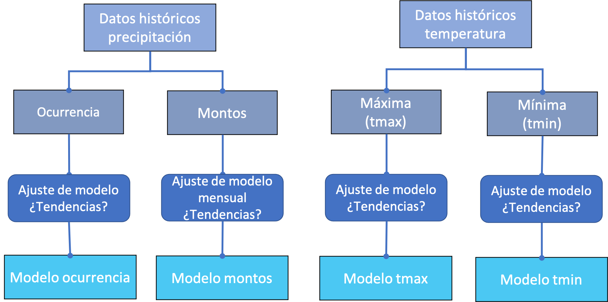
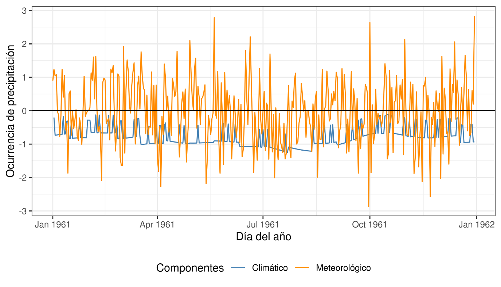
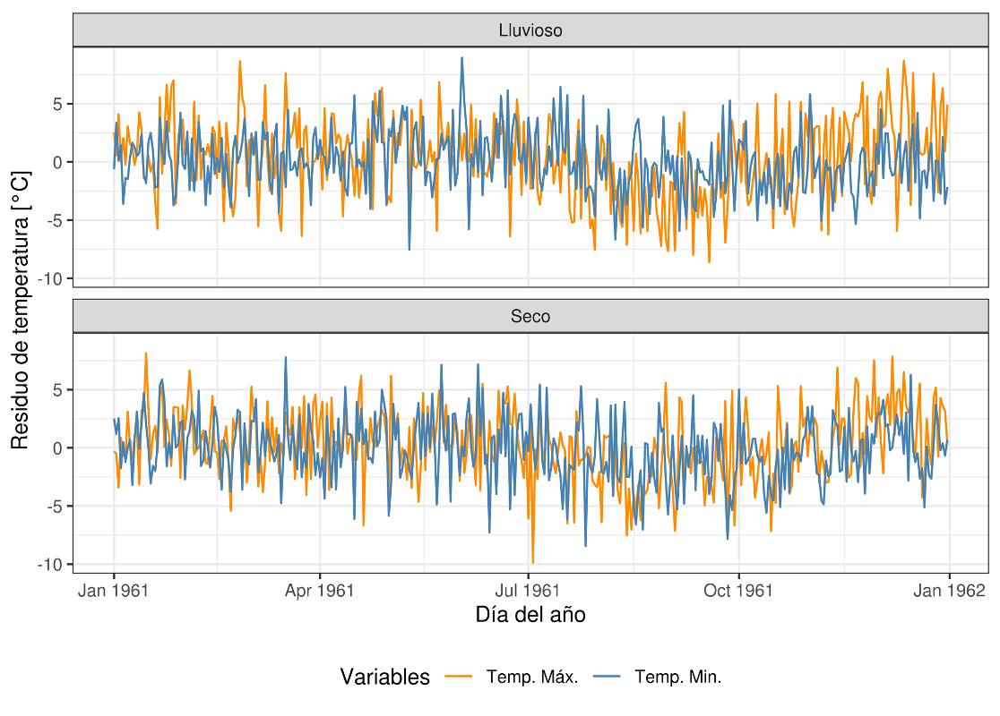
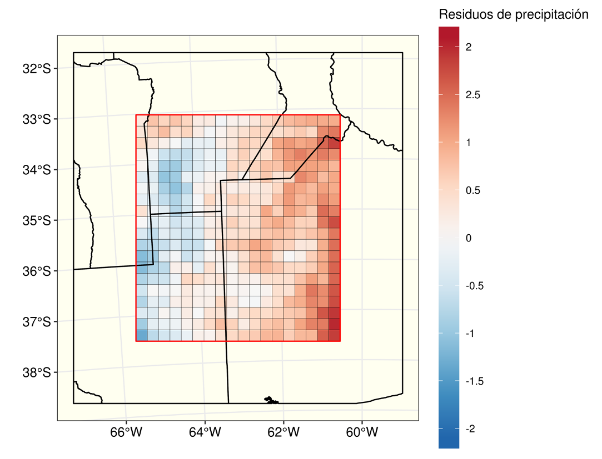
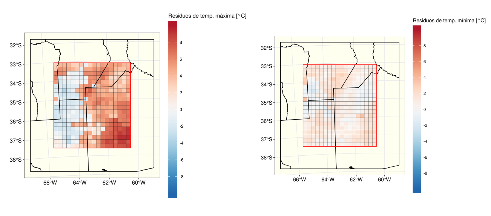
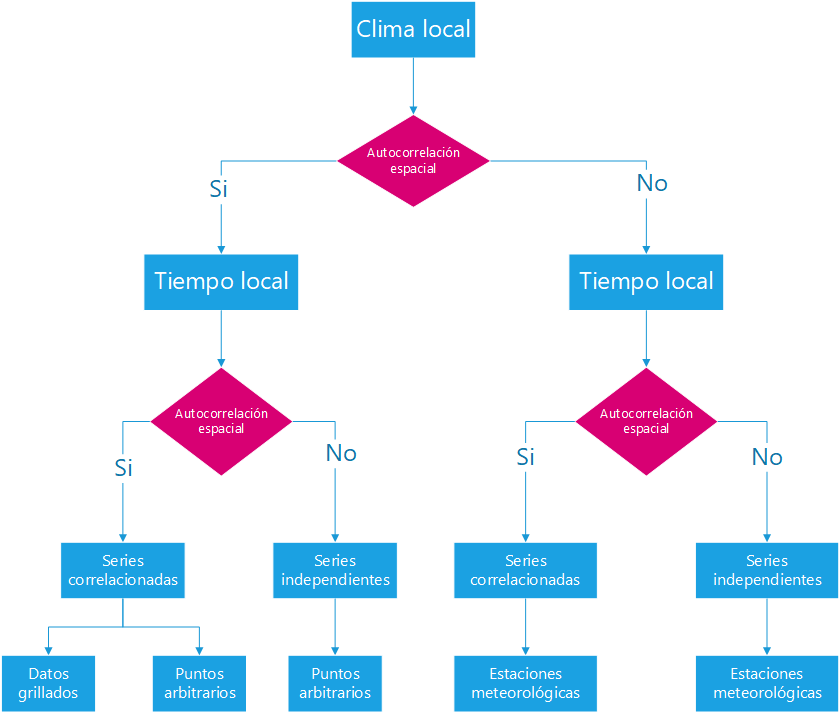

\linenumbers
\doublespacing

```{r, echo = FALSE, include = FALSE}
# Instalar el paquete pacman que permite instalar y/o cargar los paquetes necesarios
if (!require("pacman")) install.packages("pacman", repos = 'http://cran.us.r-project.org')

# Instalar o cargar los paquetes necesarios
pacman::p_load("dplyr", "here", "fs", "devtools", "glue", "readr", "sf", "progress", "ggfortify", "xts", "ggplot2", "lubridate", "fortify", "cowplot", "RColorBrewer", "RandomFields", "kableExtra", "knitr", "mgcv")

# Instalar el paquete para graficar GAMs
if (!require("gratia"))  devtools::install_github('gavinsimpson/gratia')

```

# Introducción 

El análisis de series climáticas es siempre un desafío y más aún en regiones donde la disponibilidad de las mismas es escasa. Este déficit es un problema especialmente importante para la caracterización del riesgo de desastres naturales. Este tipo de aplicaciones demandan largas series climáticas para la realización de análisis cuantitativos del riesgo de desastres que son claves para la estimación de su recurrencia y de las pérdidas asociadas. Las series climáticas deben  capturar la variabilidad natural del clima de la región de interés.

Al tratarse de un insumo necesario para el análisis probabilista de sequías el Sistema de Información sobre Sequías para el sur de Sudamérica (SISSA) desarrolló un generador de datos climáticos sintéticos. Los generadores estocásticos de clima producen series diarias de variables climáticas con propiedades estadísticas consistentes a las de los datos observados. Las principales variables de importancia son temperaturas máxima y mínima y precipitación diaria. En muchas regiones estos datos se encuentran incompletos o son directamente inexistentes. Los registros suelen tener una duración insuficiente o sólo estar disponibles agregados mensualmente. La cobertura espacial es otro de los problemas más comunes ya que, en general, las redes de observación meteorológica son poco densas aún en zonas donde la información meteorológica es de vital importancia. 

La mayoría de los enfoques tradicionales para la generación de series estocásticas están limitados por su capacidad de generar datos solamente en localidades para las que se cuenta con observaciones (por ejemplo, donde existen estaciones meteorológicas). Otra desventaja de algunas de estas herramientas (sobre todo los generadores no paramétricos basados en remuestreo de observaciones) es que solamente pueden producir valores dentro del rango observado en el registro histórico. En este proyecto, el generador desarrollado se basó en el modelo diseñado por Verdin *et al.* [-@RN3540]. Este generador estocástico diario multivariado produce series sintéticas de precipitación y temperaturas máxima y mínima. El generador de Verdin *et al.* [-@RN3540] utiliza cuatro modelos estadísticos para modelar la ocurrencia y montos de precipitación y temperatura máxima y mínima basados en Modelos Lineales Generalizados (GLMs). Estos modelos son paramétricos y utilizan regresiones lineales entre las variables para modelarlas. El proceso de ocurrencia de precipitación se modela como una regresión probit mientras que los montos se ajustan a una distribución aleatoria Gamma. Las temperaturas máximas y mínimas son consideradas variables autorregresivas condicionadas por la precipitación. Sin embargo, una de las limitaciones fundamentales del generador de Verdin *et al.* [-@RN3540] es que las temperaturas máxima y mínima se generan en forma independiente para cada día, por lo cual la amplitud térmica diaria simulada a veces no es realista.
Los diagnósticos realizados en base al generador de Verdin *et al.* [-@RN3540] demostraron que algunas propiedades de las series sintéticas producidas no reflejaban fielmente características importantes para el análisis de las sequías, por ejemplo, la persistencia de secuencias de días secos y lluviosos. Por este motivo, en este trabajo solo se mantuvo la estructura general del modelo de Verdin *et al.* [-@RN3540] y se modificaron todos los algoritmos (modelos estadísticos) para obtener series sintéticas más consistentes con los registros históricos.

# Fundamento 

A partir de los datos climáticos históricos comienza el proceso de ajuste de un modelo estadístico que permita representar el comportamiento de cada una de las variables para cada localidad. El generador está dividido en cuatro modelos aditivos generalizados: dos para modelar la precipitación y dos para las temperaturas máxima y mínima, respectivamente. El concepto principal detrás de la generación de series sintéticas es que cada valor de una variable puede ser considerado como la suma de una componente climática (clima local) y otra componente meteorológica aleatoria o tiempo local [@RN3538], es decir

$$
X_{i,s} = clima\ local  + tiempo\ local
$$
donde $X_{i,s}$ corresponde al valor de la variable *X* en el día *i* en la localidad *s*; clima local corresponde a un valor medio de la variable para el día *i* en la localidad *s* y tiempo local corresponde a un estado particular de la atmósfera en el día *i* en la localidad *s*. El componente climático es especificado a través del ajuste de cada uno de los cuatro modelos aditivos del generador. El componente meteorológico corresponde a los residuos de los modelos (la diferencia entre los valores históricos y el componente climático estimado), es decir, a la variabilidad no explicada por los mismos.
El proceso de ajuste culmina con los parámetros ajustados para los cuatro modelos mencionados. Posteriormente, se generan datos para los años a simular que corresponden a los valores medios de la distribución para cada día del año (clima local). Luego, se simulan una serie de valores aleatorios, a partir de los residuos de cada modelo, que corresponden a la variabilidad propia de cada realización (tiempo local). La Figura \@ref(fig:tiempo-clima) muestra un ejemplo de ambos componentes para la temperatura máxima diaria del año 1961 en la localidad de Junín (Argentina).

```{r tiempo-clima, eval = TRUE, echo = FALSE, out.width = "75%", fig.align="center", fig.cap = "Componentes clima local y tiempo local"}
knitr::include_graphics('/Users/alessiobocco/weather-generator-1/workshop/docs/figures/local_climate_weather.png')
```

# Tipos de series sintéticas

El generador GAMWGEN produce distintos tipos de series sintéticas. Desde el punto de vista temporal, las series pueden ser __no condicionadas__ (Figura \@ref(fig:serie-estacionaria)), es decir, puramente estacionarias; __pseudohistóricas__ (Figura \@ref(fig:serie-pseudohistorica)), que copian la variabilidad de baja frecuencia y los cambios en la serie climática observada y __condicionadas__ (Figura \@ref(fig:serie-condicionada)) que son series forzadas a seguir la trayectoria de una salida de un modelo de cambio climático o una trayectoria arbitraria definida por el usuario. Las siguientes Figuras muestran distintos ejemplos de lo mencionado. 

```{r serie-estacionaria, eval = TRUE, echo = FALSE, out.width = "75%", fig.align="center", fig.cap = "Tipos de series sintéticas: Series estacionarias"}
knitr::include_graphics('/Users/alessiobocco/weather-generator-1/workshop/docs/figures/serie_estacionaria.png')
```

La línea negra corresponde a la serie temporal observada mientras que las distintas líneas celestes corresponden a realizaciones del generador. Al tratarse de series puramente estocásticas, son independientes entre sí. 

```{r serie-pseudohistorica, eval = TRUE, echo = FALSE, out.width = "75%", fig.align="center", fig.cap = " Tipos de series sintéticas: Series pseudihistóricas"}
knitr::include_graphics('/Users/alessiobocco/weather-generator-1/workshop/docs/figures/serie_pesudohistorica.png')
```

La línea negra corresponde a la serie temporal observada mientras que las distintas líneas celestes corresponden a realizaciones del generador. En este caso, el generador fue forzado a seguir la trayectoria en los datos observados, por lo tanto, las series generadas siguen las variaciones de los datos observados. 

```{r serie-condicionada, eval = TRUE, echo = FALSE, out.width = "75%", fig.align="center", fig.cap = " Tipos de series sintéticas: Series condicionadas"}
knitr::include_graphics('/Users/alessiobocco/weather-generator-1/workshop/docs/figures/serie_condicionada.png')
```

En esta configuración el generador sigue una trayectoria arbitraria elegida por el usuario. En este caso es una trayectoria lineal por lo que la precipitación aumenta un determinado porcentaje por año de manera lineal. 

Desde el punto de vista espacial se pueden generar series en estaciones meteorológicas, en puntos que no se correspondan con estaciones o en una grilla regular. La Figura \@ref(fig:datos-grillados) muestra un ejemplo de la generación en grillas sobre el Paraguay. 

```{r datos-grillados, eval = TRUE, echo = FALSE, out.width = "75%", fig.align="center", fig.cap = "Datos grillados."}
knitr::include_graphics('/Users/alessiobocco/weather-generator-1/workshop/docs/figures/datos_grillados.png')
```

El panel de la izquierda muestra la temperatura máxima del día 1 de enero de 2000 para todo el territorio del Paraguay mientras que el mapa del panel derecho muestra la precipitación diaria para el mismo día. 

# Metodología

Como su nombre indica, el generador está basado en Modelos Generalizados Aditivos (GAM, por sus siglas en inglés). Como se mencionó en le Introducción, este generador está basado en uno similar desarrollado por Verdin *et al.* [-@RN3540]. Dicho generador estocástico utilizaba modelos lineales generalizados (GLM, por sus siglas en inglés). Los GLM son modelos muy interesantes ya que son fatalmente interpretables aunque carecen de la flexibilidad necesaria para capturar complejos patrones como las variaciones estacionales. Por ello, en esta versión se cambiaron los GLMs por GAMS. Estos nuevos modelos están siendo muy utilizados en diversas áreas porque heredan lo mejor de los GLM pero son mucho más flexibles. En la siguiente sección se describirán brevemente los GAMs. 

## Introducción a los Modelos Aditivos Generalizados

### Interpretabilidad vs Complejidad

La modelación estadística es una tarea muy compleja y que, en mnuchos casos, demanda un compromiso entre la interpretabilidad y complejidad de los modelos. La Figura \@ref(fig:tipos-modelos) muestra tres alternativas con creciente nivel de complejidad.

```{r tipos-modelos, eval = TRUE, echo = FALSE, fig.align="center", fig.cap = "Modelos estadísticos", fig.width = 4, fig.height = 3, out.width = '70%'}
knitr::include_graphics('/Users/alessiobocco/weather-generator-1/workshop/docs/figures/tipos_modelos.png')
```

En el extremo izquierdo, se encuentran los modelos lineales. Estos modelos son fáciles de interpretar porque poseen una ecuación lineal explícita y, además, es muy sencillo hacer inferencia a partir de ellos. Al tener una ecuación, cada variable tiene un coeficiente lineal que permite entender la importancia de cada una de las variables involucradas en el modelo. Sin embargo, en muchas aplicaciones es necesario modelar relaciones más complejas que sólo lineales. En los casos en las que las relaciones son no lineales, un gran porcentaje de la variabilidad se pierde y la inferencia realizada por dicho modelo sería muy pobre. 
En el otro extremo del espectro hay toda una serie de modelos de tipo "caja negra" como las redes neuronales, random forest, árboles de regresión, etc. Estos modelos son muy buenos para modelar complejas relaciones pero son muy difíciles de interpretar y de entender que está sucediendo en el sistema. Son muy útiles para clasificar pero no sirven para entender como una variable se relaciona con el resultado del modelo. 
Los GAMs proveen un interesante punto intermedio ya que se pueden ajustar relaciones complejas, no lineales e interacciones. Los modelos son explícitos y se pueden observar las relaciones entre variables y entender porque se produce un resultado determinado.

#### Relaciones no lineales

En general, las relaciones entre variables de la naturaleza no son lineales y adquieren patrones muy complejos. En la Figura 4 se muestra un ejemplo de datos sintéticas para ejemplificar este concepto. 

```{r, message=FALSE, warning=FALSE}
# Se simulan datos a partir de un GAM con distribución normal y 
# escala 0

# Se define una semilla para garantizar reproducibilidad
set.seed(2) 

# Se simulan 400 valores a partir del modelo
dat <- mgcv::gamSim(1, n=400, dist = "normal", 
                    scale = 0, verbose = FALSE)
dat <- dat[,c("y", "x0", "x1", "x2", "x3")]
```

La Figura \@ref(fig:relaciones-no-lineales) muestra una diagrama de dispersión con valores simulados para ver su distribución. 

```{r relaciones-no-lineales, eval = TRUE, echo = TRUE, message = FALSE, fig.align="center", fig.cap = "Relaciones no lineales.",  fig.width = 4, fig.height = 3}

# Gráfico con los valores simulados
ggplot2::ggplot(dat, ggplot2::aes(y = y,x = x2)) +
    ggplot2::geom_point() +
    ggplot2::theme_minimal()
```

Este diagrama de dispersión muestra dos variables que claramente se encuentran relacionadas pero no de manera lineal. Para continuar con el ejemplo de la sección anterior se ajustarán dos modelos a estos datos simulados, uno modlo lineal y uno generalizado aditivo. 

Al ajustar una regresión lineal simple a estos datos se obtiene una recta que atraviesa toda la nube de puntos. La Figura \@ref(fig:ajuste-lineal) muestra el resultado de la regresión. La línea azul corresponde al ajuste del modelo lineal y el área gris, al intervalo de confianza del 95%.

```{r ajuste-lineal, eval = TRUE, echo = TRUE, message = FALSE, fig.align="center", fig.cap = "GAMs: Ajuste lineal de datos simulados.",  fig.width = 4, fig.height = 3}

# Grafico con el ajuste lineal
ggplot2::ggplot(dat, ggplot2::aes(x2, y)) + 
    ggplot2::geom_point() +
    ggplot2::geom_smooth(method = 'lm', se = TRUE, ggplot2::aes(colour = "Lineal")) +
    ggplot2::scale_colour_manual(name = "", values = c("Steelblue")) +
    ggplot2::theme_minimal() +
  ggplot2::theme(legend.position="none")

```
La regresión resultante representa la tendencia descendente en los datos simulados pero no es capaz de capturar las principales características de los datos como son las dos ondas con amplitud decreciente que se observa en la Figura  \@ref(fig:ajuste-lineal).

###### Modelo lineal 

El modelo lineal se puede expresar mediante la siguiente ecuación: 

$$
y_i = \beta_0 + x_{1i}\beta_1 + \ldots + \epsilon_i 
$$

dónde, $y_i$ corresponde a la variable respuesta y es una combinación lineal de las variables regresoras; $\beta_0$ corresponde a la ordenada al origen, $x_{1i}\beta_1$ corresponde a la variable regreso $\beta_1$ multiplicada por un coeficiente $x_{i}$ que surge del ajuste del modelo y un término de error $\epsilon_i$ que usualmente tiene una distribución normal. 
Se pueden incluir más términos al modelo lineal, como términos cuadráticos o cúbicos, pero se corre el riesgo de sobreajustar severamente el modelo.
En R el ajuste de los modelos lineales se realiza con la función `lm` cuyo primer argumento es la fórmula del modelo, en este caso: __y ~ x2__. 

```{r}
# Ajuste del modelo lineal
modelo_lineal <- lm(y ~ x2, data = dat)

# Evaluación de los resultados
summary(modelo_lineal)
```

Con la función `summary` se muestra una descripción del modelo ajustado así como una evaluación preliminar de la bondad del ajuste. En la sección *Coefficients* se muestra la significacia de cada uno de los términos del modelo lineal, ordenada el origen ($\beta_0$) y pendiente ($\beta_1$), y se observa que ambos son altamente significativos. Sin embargo, al analizar el $R^2$, sólo un 28% de la variabilidad es explicada por el modelo lineal. 
Lo anterior se comprueba al graficar los residuos del modelo. Los residuos son la diferencia entre los valores ajustados y observados. En la Figura \@ref(fig:residuos-lineal) se muestra el diagnóstico de residuos vs valor ajustados, en el eje horizontal se ubican datos ajustados y en el eje vertical, los residuos del modelo.

```{r residuos-lineal,   fig.align="center", fig.width = 4, fig.height = 3, fig.cap = "Residuos del modelo lineal."}
# Calculo de los residuos del modelo
residuals <- ggplot2::fortify(modelo_lineal)

# Gráfico de residuos
ggplot2::ggplot(residuals, aes(x = .fitted, y = .resid)) + 
  ggplot2::geom_point() +
  ggplot2::geom_smooth(se = FALSE) +
  ggplot2::geom_hline(yintercept = 0, linetype = 'dashed') +
  ggplot2::theme_bw() +
  ggplot2::xlab('Ajustados') + ggplot2::ylab('Residuos')
```

Si el modelo hubiera ajustado satisfactoriamente los datos, los residuos deberían distribuirse al azar y sin un patrón específico. Sin embargo, se observa en la Figura \@ref(fig:residuos-lineal) que ésto no sucede y que los puntos tiene un patrón muy marcado. Esto quiere decir que hay un gran porcentaje de la variabilidad que no es explicada por el modelo y por lo tanto, inferir sobre este modelo sería un grave error. 
Si en lugar de utilizar un modelo lineal, se ajustan los datos con un `gam`, los resultados son muy diferentes. En la Figura \@ref(fig:ajuste-gam) se muestra el ajuste del `gam` a los datos observados. 

```{r ajuste-gam, eval = TRUE, echo = FALSE, fig.align="center", fig.width = 4, fig.height = 3, fig.cap = "Ajuste no lineal."}
ggplot2::ggplot(dat, ggplot2::aes(x2, y)) + 
    ggplot2::geom_point() +
    ggplot2::geom_smooth(method = 'gam', formula = y ~ s(x), se = TRUE, ggplot2::aes(colour = "GAM")) +
    ggplot2::scale_colour_manual(name = "", values = c('DarkOrange')) +
    ggplot2::theme_minimal() +
  ggplot2::theme(legend.position="none")
```

La línea naranja corresponde al GAM ajustado, mientras que el área gris corresponde al intervalo de confianza del 95%. A diferencia del modelo lineal, el GAM es mucho más flexible y, no sólo sigue la tendencia descendente sino que captura las distintas ondas a pesar de su distinta amplitud. 
Los GAMs ajustan el modelo a través de funciones suavizadas o splines que pueden tomar casi cualquier forma. Al utilizar splines los GAMs pueden capturar diversos tipos de relaciones no lineales y es por esto que son tan flexibles y adaptables a distintos contextos. En el presente paquete el ajuste de los `gam` se realiza con el paquete `mgcv` de Simon Wood [-@RN5393]

```{r}
# Ajuste de un GAM con el paquete mgcv
modelo_gam <- mgcv::gam(y ~ s(x2), data = dat)

#
summary(modelo_gam)
```
La función `summary` permite ver los resultados del ajuste del GAM. En este caso no hay un sólo panel para los coeficientes como en el modelo lineal sino que en *Parametric coefficients* se encuentra la ordenada al origen y bajo *Approximate significance of smooth terms* se muestra la significancia del spline. Si bien el modelo no es perfecto, el $R^2$ aumentó del 20% a casi el 70%. 

A diferencia de los modelos lineales o lineales generalizados donde la media de la variable respuesta es una suma de los términos lineales:

$$
y_i = \beta_0 +\sum_j \color{red}{ \beta_j x_{ji}} +\epsilon_i
$$
Mientras que en un GAM, la media de la variable respuesta es una suma de _funciones suavizadas_ o _smooths_. 

$$
y_i = \beta_0 + \sum_j \color{red}{s_j(x_{ji})} + \epsilon_i
$$
dónde, $\beta_0$ corresponde a la ordenada al origen; $\sum_j {s_j(x_{ji})}$ corresponde a la suma de las _funciones suavizadas_ y $\epsilon_i$ corresponde al término de error. 
Al realizar el gráfico de residuos vs valores ajustados es posible verificar si el modelo ajustó tan bien como indica el valor de $R^2$. En la Figura \@ref(fig:residuos-gam) se muestra dicho gráfico. 

```{r residuos-gam,  fig.width = 4, fig.height = 3, fig.align="center", fig.cap = 'Residuos del GAM.'}
# Obtener los residuos del GAM
residuals <- data.frame(fitted = modelo_gam$fitted.values,
                            resid = resid(modelo_gam)) %>%
    tibble::as_tibble()

# Gráfico de residuos vs valores ajustados
ggplot2::ggplot(residuals, aes(x = fitted, y = resid)) + 
  ggplot2::geom_point() +
  ggplot2::geom_smooth(se = FALSE) +
  ggplot2::geom_hline(yintercept = 0, linetype = 'dashed') +
  ggplot2::theme_bw() +
  ggplot2::xlab('Ajustados') + ggplot2::ylab('Residuos')
```
Al utilizar un GAM los residuos tienen una distribución casi aleatoria sin una tendencia clara como si fue el caso del modelo lineal. Este es sólo en sencillo ejemplo del potencial que tienen los GAMs para modelar complejas relaciones. Si se desea profundizar más en el tema se recomienda revisar el libro de Simon Wood [-@RN3704].

## Modelación  

Como se mencionó anteriormente, el generador estocástico tiene como base cuatro modelos generalizados, dos para temperaturas máxima y mínima y dos para la precipitación que modelan la ocurrencia y los montos diarios. La Figura \@ref(fig:modelos) muestra una diagrama con el proceso de ajuste de cada uno de ellos.

```{r modelos, eval = TRUE, echo = FALSE,  fig.width = 4, fig.height = 3, out.width = '70%', fig.align="center", fig.cap = " Modelos estadísticos"}

```

Partiendo de la base de datos se extraen los datos diarios de temperaturas máxima y mínima y precipitación. Los valores de temperaturas son utilizados para ajustar un GAM que modelará la componente climática. Estos modelos pueden incluir o no medias trimestrales que servirán para condicionar el modelo a seguir una determinada trayectoria. Para el caso de la precipitación el tratamiento es diferente. El fenómeno se divide en dos: ocurrencia de precipitación y montos diarios. La ocurrencia se modela con GAM para toda la serie que puede o no estar condicionado por totales trimestrales de lluvia. Los montos, en cambio, son modelados a escala mensual. Es decir, se ajustan doce modelos, uno para cada mes del año. Se utiliza esta modalidad para capturar mejor las características propias del ciclo estacional de la precipitación de cada región. 

A continuación se describirán cada uno de los modelos recién mencionados. La sección se encuentra dividida por un lado se describirá la modelación del __clima local__

### Clima local

#### Ocurrencia de lluvia

El ajuste del modelo de ocurrencia comienza con la definición de un día lluvioso. Según la Organización Meteorológica Mundial (OMM), se considera como día lluvioso a aquel día con una precipitación igual o mayor a 0.1 mm. Este valor, si bien es el sugerido por la OMM, puede ser modificado por el usuario si así lo dispone. Una vez definida la ocurrencia de lluvia se ajusta el modelo. La ocurrencia de lluvia es una variable de tipo binaria, es decir, un día puede ser lluvioso (1) o seco (0), y es muy  bien representada a través de una regresión probit Kleiber *et al.* [-@RN3539]. Este tipo de regresiones se basan en procesos latentes Gaussianos, $W_{s,t}$, que se modelan con la siguiente relación:

$$
O_{s,t} = \Pi_{\{W_{s,t} > 0|} 
$$
Si el proceso $W_{s,t}$ es positivo, significa que lloverá en el día **t** y en la estación **s** y a ese día se le asignará el valor 1. Si el proceso es negativo significa que no lloverá en el día **t** y en la estación **s** y ese día se le asignará el valor 0. El uso de este tipo de procesos latentes está justificado en que, en una región, la ocurrencia de lluvia en las distintas estaciones tenderá a estar correlacionada. La función media del proceso latente Gaussiano es una regresión entre variables que se expresa de la siguiente manera:

$$
O_{s,t} = (s, O_{s,t-1}, f(doy(t)), f(ST(t)), f(lon, lat))
$$
donde $O_{s,t}$ corresponde a la ocurrencia de lluvia en sitio y día determinado; $s$ corresponde al efecto del sitio **s** (ordenada al origen); $O_{s,t-1}$ corresponde a la ocurrencia del día previo que es un término autorregresivo; $f(doy(t))$ corresponde a una función cíclica de los días del año para considerar el efecto de la estacionalidad sobre la ocurrencia de lluvia; $f(ST(t))$ corresponde a una función suavizada de los acumulados estacionales de precipitación (solo se utiliza si se desea condicionar el modelo) y $f(lon, lat)$ corresponde a las coordenadas del punto **s** (solo se utiliza en el modelo espacial). En la práctica, esta covariable se divide en cuatro, una para cada trimestre del año, asignándole el valor de 0 para los momentos fuera del respectivo trimestre.  Es importante notar que para la ocurrencia de precipitación se usa un solo término autorregresivo. Este término es muy importante para la correcta modelización de las rachas secas y lluviosas mientras que el día del año incorpora la variabilidad intra-anual. 

#### Montos diarios de lluvia

El modelo de montos diarios de lluvia difiere del anterior en que no se usan todos los datos de la serie, sino que se extraen de la base de datos los montos de precipitación únicamente para los días lluviosos. La intensidad de la precipitación para una localidad s y tiempo t es modelada como una variable aleatoria Gamma cuyos parámetros de forma y escala varían en el tiempo y en el espacio (Kleiber *et al.* [-@RN3539]). La función Gamma ha sido ampliamente utilizada en la región para la modelación de acumulados de lluvia. El modelo de montos puede ser expresado de la siguiente manera:

$$
I_{s,t} = (s, O_{s,t-1}, f(ST(t)), f(lon, lat))
$$

donde, $I_{s,t}$ corresponde a los montos de precipitación en un sitio y día determinado; $O_{s,t-1}$ corresponde a la ocurrencia del día previo para considerar la autocorrelación temporal; $f(ST(t))$ corresponde a una función suavizada de los acumulados estacionales de precipitación (solo se utiliza si se desea condicionar el modelo) y $f(lon, lat)$ corresponde a las coordenadas del punto **s** (solo se utiliza en el modelo espacial).
A diferencia del modelo anterior – que modela los años calendarios completos a través de la estacionalidad del día del año – la serie de montos diarios es dividida en función del mes del año para ajustar una distribución a cada mes para obtener así parámetros mensuales más precisos. Gracias a esta modificación se obtienen parámetros que varían en el tiempo y en el espacio lo que permite capturar la variabilidad espacial de la precipitación. Al igual que en el modelo de ocurrencia, la inclusión del total trimestral es necesaria si se desean simular series condicionadas.

#### Temperatura

Para el caso de la temperatura se utiliza una metodología similar a la utilizada para la precipitación,  basada en Kleiber *et al.* [-@RN3538]. A partir de los datos observados de temperatura se ajustan dos modelos: uno de máxima y otro de mínima. Ambos modelos utilizan las mismas variables para realizar el ajuste. El modelo puede ser expresado de la siguiente manera:

$$
X_{s,t} = (s,  O_{s,t}, O_{s,t-1}, f(T_{x_{(s, t-1)}}, T_{n_{(s, t-1)}}), f(doy(t)), f(SX(t), SN(t)), f(lon, lat))
$$
donde, $X_{s,t}$  corresponde a la temperatura máxima o mínima en un sitio y momento determinado; $s$ corresponde al efecto del sitio **s** (ordenada al origen);  $O_{s,t}$ corresponde a la ocurrencia de lluvia en sitio y día determinado; $O_{s,t-1}$ corresponde a la ocurrencia del día previo; $f(T_{x_{(s, t-1)}}, T_{n_{(s, t-1)}})$ corresponde a una función suavizada de la interacción entre la temperatura máxima y mínima del día previo; $f(doy(t))$ corresponde a una función cíclica de los días del año para considerar el efecto de la estacionalidad sobre la temperatura;  El término $f(SX(t), SN(t))$ corresponde a la interacción entre las medias estacionales de temperatura máxima y mínima y, como se explicó en la sección anterior, se incluyen para crear modelos condicionados y $f(lon, lat)$ corresponde a las coordenadas del punto **s** (solo se utiliza en el modelo espacial).
La ocurrencia de lluvia es muy importante ya que en general los días lluviosos tienen temperaturas más bajas que los secos, sobre todo en verano, por lo que debe ser incluido en el ajuste. La Figura 6 es un ejemplo de esta influencia en Junín, en donde se muestra la amplitud térmica para cada mes del año en función del tipo de día, seco o lluvioso. 

### Tiempo local

#### Para una estación

##### Precipitación

El **tiempo local** de la ocurrencia de precipitación se modela a través de los residuos de la regresión probit. Por definición estos residuos tienen una distribución $X \sim \mathcal{N}(0,\,1)\,$. Por lo tanto, generar valores para el tiempo local es muy sencillo, solo se necesita de una función gaussiana que genere números aleatorios. La Figura \@ref(fig:ruido-precipitacion) muestra un ejemplo de la generación de clima local y tiempo local para una estación meteorológica de Argentina. 

```{r ruido-precipitacion, eval = TRUE, echo = FALSE, out.width = "75%", fig.align="center", fig.cap = "Tiempo local: precipitación"}

```

La Figura \@ref(fig:ruido-precipitacion) muestra sólo un año para mejorar la visualización pero su interpretación es válida para toda la longitud de la serie. La línea azul corresponde al clima local modelado a través del GAM y la naranja al ruido aleatorio creado a partir de una distribución $X \sim \mathcal{N}(0,\,1)\,$. La sumatoria de ambos componentes determinarán si el día es lluvioso o no. Si la suma es positiva, lloverá, caso contrario será un día seco. Se puede observar en la línea azul un patrón estacional debido al régimen de precipitación tipo monzónico de esta región con picos de más días lluviosos durante el verano mientras que en invierno disminuyen marcadamente. 
Esta misma serie temporal de números aleatorios serán la base para la generación de los montos de precipitación. 

##### Temperatura

El tiempo local de las temperaturas máxima y mínima se modela de una manera diferente. En este caso se toman los residuos de cada uno de los GAMs, es decir, la diferencia entre el valor ajustado por el modelo y el valor observado de temperatura. Además, como la temperatura está fuertemente influenciada por el tipo de día, días lluviosos tienden a tener una menor amplitud térmica que los días secos, los residuos se separan en función del tipo de día. Para capturar mejor el patrón estacional de la temperatura, los residuos se agrupan por mes y se ajusta un modelo bivariado que contemple los residuos de temperaturas máxima y mínima. El uso de un modelos bivariado es una alternativa muy interesante para mantener la consistencia entre ambas variables, es decir, que la temperatura máxima no supere a la mínima. La siguiente Figura \@ref(fig:ruido-temperatura) es un ejemplo de las series de tiempo local para una localidad de Argentina. 

```{r ruido-temperatura, eval = TRUE, echo = FALSE, out.width = "75%", fig.align="center", fig.cap = "Tiempo local: temperatura"}

```

La Figura \@ref(fig:ruido-temperatura) esta dividida en dos paneles, el superior muestra el tiempo local para los días lluviosos y el inferior para los días secos. La línea naranja corresponde a los valores de tiempo local para temperatura máxima y los azules para temperatura mínima. Si bien ambas series difieren en magnitud y variabilidad, las dos tienden a variar conjuntamente. 

#### Para una grilla

Para generar datos sobre una grilla regular o en puntos donde no hay datos para ajustar los modelos se debe utilizar el modelo espacial. La generación del tiempo local en el espacio es conceptualmente idéntico a la generación sobre estaciones meteorológicas sólo que utiliza campos gaussianos para incluir la dimensión espacial. Los campos gaussianos se generan con el paquete `RandomFields` (Schlather, Martin [-@RN4406]) y capturan la variabilidad espacial de cada una de las variables a partir de su variograma. 
##### Precipitación

Para la precipitación se utiliza un modelo exponencial que utiliza como parámetros el variograma ajustado a partir de los datos observados usando máxima verosimilitud. Este modelo permite simular campos con una muy buena consistencia espacial. La ocurrencia de precipitación no ocurre de manera aislada en una región sino que, en general, un evento lluvioso abarca una importante superficie. La siguiente Figura \@ref(fig:random-field-precipitacion) es una ejemplo de los campos aleatorios generados sobre una grilla regular para una región de Argentina. 

```{r random-field-precipitacion, eval = TRUE, echo = FALSE, out.width = "75%", fig.align="center", fig.cap = "Tiempo local: precipitación sobre una grilla"}

```

La interpretación es análoga a la mostrada para una estación puntual. Los valores para cada píxel se suman a la componente climática y así se determina si el día será lluvioso o no. Este tipo de campos se generan para todos los días de la simulación y cada campo diario es independiente del anterior. 

##### Temperatura

Al igual que para una estación, los campos gaussianos que se generan son bivariados. Se utiliza el modelo Bivariado de Whittle Matern incluido en el paquete `RandomFields` (Schlather, Martin [-@RN4406]). La siguiente Figura \@ref(fig:random-field-temperature) es un ejemplo para un día de una realización para grilla regular sobre Argentina. 

```{r random-field-temperature, eval = TRUE, echo = FALSE, out.width = "75%", fig.align="center", fig.cap = "Tiempo local de temperatura sobre una grilla"}

```

Ambos campos se generan simultáneamente para temperaturas máxima y mínima y discriminando entre días secos y lluviosos. Esto quiere decir que en el proceso de creación de los campos se generan cuatro capas diferentes que luego se combinan en función del tipo de día de cada píxel resultando en dos campos integradores. 
Los valores para cada píxel se sumen a la componente climática y así se obtiene el valor final para cada día de la simulación. 

## Tipos de modelos

Basado en lo descrito en secciones anteriores, el generador cuenta con dos variantes: una  es capaz de simular en una grilla o en localidades arbitrarias, y la otra variante solo puede generar series para sitios donde existen datos históricos y que fueron utilizados en el proceso de ajuste. La Figura \@ref(fig:diagrama-flujo) muestra un diagrama del flujo de las dos variantes del generador, que de aquí en más se denominarán modelo espacial y local, respectivamente. 

```{r diagrama-flujo, eval = TRUE, echo = FALSE, out.width = "75%", fig.align="center", fig.cap = "Diagrama de flujo del generador."}

```
Los “caminos” asociados con cada variante del generador comienzan a partir de la extracción de la información meteorológica y luego se bifurcan en función de como se considera la autocorrelación espacial de las distintas estaciones meteorológicas usadas para entrenar los modelos.

La rama izquierda de la Figura \@ref(fig:diagrama-flujo), corresponde al denominado "modelo espacial". En esta variante, la autocorrelación espacial forma parte del modelo que ajusta el clima local. Es decir, cada uno de los GAMs incorpora las coordenadas de cada estación meteorológica para modelar la autocorrelación espacial. Los datos de las estaciones meteorológicas de la red se agrupan  en una sola matriz y los procesos no se modelan de manera puntual, sino que éstos varían en el espacio. Sólo se ajusta un modelo por variable meteorológica que agrupa a todas las estaciones meteorológicas. Luego, al considerar la modelación del __tiempo local__, nuevamente hay dos posibilidades. Si la dependencia espacial se considera, se generan series completamente correlacionadas a través de campos gaussianos aleatorios por lo que el generador puede simular sobre una grilla regular o sobre puntos arbitrarios que no necesariamente deben ser estaciones meteorológicas. En cambio, si la dependencia espacial no se considera en la componente meteorológica, sólo pueden generarse series sobre puntos y no sobre una grilla porque los píxeles serían independientes y ésto no tiene sentido físico. 
En la rama derecha, en cambio, la autocorrelación espacial no forma parte de la _componente climática_ y corresponde al denominado "modelo local". En esta variante se ajusta un modelo para cada estación meteorológica. Luego, al simular la componente meteorológica, los caminos vuelven a dividirse. Las estaciones pueden seguir siendo independientes y la componente meteorológica puede ser estimada para cada estación sin considerar a sus vecinas. La otra posibilidad consiste en agrupar todas las estaciones y estimar la componente meteorológica considerando la existencia de autocorrelación espacial por lo que las estaciones más próximas serían más similares entre sí comparadas con las más lejanas.
En el paquete GAMWGEN las funciones utilizadsas para el "modelo espacial" tiene el sufijo `spatial` mientras que aquellas asociadas al "modelo local" tienen el sufijo `local`. 

# Aplicación 

En esta sección se mostrarán ejemplos de aplicación del generador para generar distintos tipos de series explicando las funciones necesarias y cada uno de los parámetros. 

## Instalar paquetes necesarios 

El primer paso es comprobar que todos los paquetes necesarios estén instalados y si no es así, descargarlos e instalarlos. 

```{r, echo = FALSE, include = TRUE, warnings = FALSE, message=FALSE}
# Instalar el paquete pacman que permite instalar y/o cargar los paquetes necesarios
if (!require("pacman")) install.packages("pacman", repos = 'http://cran.us.r-project.org')

# Instalar o cargar los paquetes necesarios
pacman::p_load("dplyr", "here", "fs", "devtools", "glue", "readr", "sf", "progress", "ggfortify", "xts", "ggplot2", "lubridate", "xts")

# Instalar el paquete del generador de datos
if (!require("gamwgen")) devtools::install_github("CRC-SAS/weather-generator",
                                                  ref = 'gamwgen')
# Instalar el paquete para graficar GAMs
if (!require("gratia"))  devtools::install_github('gavinsimpson/gratia')

```

## Creación de directorios

El paquete tiene precargados algunos ejemplos de aplicación con datos reales de estaciones meteorológicas de la red del SISSA. 

Para poder seguir este manual se deben crear directorios donde se guardarán los datos de entrada y salida.

* /input_data: aquí se guardarán los datos meteorológicos y los metadatos de las estaciones
* /output_data: aquí se guardarán los resultados de la simulación

Si estos directorios no existen, se crearán. 

```{r, echo = FALSE}
# Comprobar que existe el directorio con datos de entrada
fs::dir_create(here::here('input_data'))
# Comprobar que existe el directorio con datos de salida
fs::dir_create(here::here('output_data'))
```

## Generación de series sintéticas sin autocorrelación espacial

Este primer ejemplo consiste en la generación de series sintéticas para estaciones meteorológicas sin considerar la dependencia espacial por lo que se utilizará el "modelo local". Es decir, se generarán series para las mismas estaciones que fueron utilizadas en el ajuste de los distintos modelos. El ejemplo está divido en tres, en una primera parte se ajustará el modelo para generar series estacionarias y luego, en una segunda parte, se incluirán coviariables estacionales para producir series pseudohistóricas. Para ambos ejemplos los datos son usados serán los mismos. Un tercer ejemplo mostrará como generar datos para más de una estación meteorológica incluyendo la dependencia espacial al modelar el _tiempo local_.

### Creación de archivos de entrada

El primer paso consiste en generar los set de datos de entrada que se descargaron al momento de instalar el paquete del generador estocástico. Estos datos son sólo a título demostrativo, si el usuario desea correr el modelo con sus propios datos deberá cambiar los objetos que se generarán en esta sección por los suyos y colocarlos en la carpeta `input_data`. 

Los archivos necesarios son:

* stations.csv
* climate.csv

```{r, echo = FALSE, message = FALSE, message=FALSE}
# Si no existen los datos locales, se copiarán del paquete.
if (!fs::file_exists('input_data/local/stations.csv')) {
  write.csv(readr::read_csv(system.file('/autorun/local', "stations.csv",  package = "gamwgen")), here::here('input_data/local/stations.csv'), row.names = FALSE)
}

# Si no existen los datos locales, se copiarán del paquete.
if (!fs::file_exists('input_data/local/climate.csv')) {
  write.csv(readr::read_csv(system.file('/autorun/local', "climate.csv",  package = "gamwgen"), col_types = "Diddd"), here::here('input_data/climate.csv'), row.names = FALSE)
}
```

Los datos meteorológicos se dividen en dos archivos separados: `stations.csv` y `climate.csv`. Los nombres de los mismos no deben ser necesariamente iguales a los usados aquí.

Los metadatos de las estaciones se alojan en el archivo `stations.csv`. Este archivo contiene la información  de las estaciones meteorológicas que serán usadas en el ajuste del modelo. Las variables que deben ser incluidas en la tabla son:

* station_id: número unívoco para cada estación meteorológica. La variable debe ser de tipo _integer_
* latitude: latitud en grados decimales. La variable debe ser de tipo _double_
* longitude: longitud en grados decimales. La variable debe ser de tipo _double_

La tabla puede tener más variables pero sólo se necesitan las anteriores. 

```{r, echo = FALSE, message = FALSE, message=FALSE}
# Se cargan los metadatos de las estaciones utilizadas
stations <- readr::read_csv(here::here('input_data/local/stations.csv')) %>%
  dplyr::rename(station_id = omm_id) %>%
  dplyr::mutate(station_id = as.integer(station_id))
```

A continuación se muestran la primera fila del dataset y los tipos de datos de cada una de las variables. 

```{r}
# Visualización de los metadatos de la estación
knitr::kable(head(stations), "latex", booktabs = T) %>%
  kableExtra::kable_styling(position = "center")
```

El objeto **stations** debe ser convertido de _tibble_ a _sf_. El sistema de referencia espacial debe ser planar. No es necesario un sistema de referencia espacial en particular, solamente las coordenadas deben estar expresadas en metros. 

```{r}
# Se convierte el objeto stations a sf y se transforma su 
# proyección de WGS 1984 a POSGAR Argentina Faja 5.
stations %<>% 
  sf::st_as_sf(coords = c("lon_dec", "lat_dec"), crs =  4326) %>%
  sf::st_transform(crs = 22185)
```

La información climática se aloja en el archivo `climate.csv`. Este archivo contiene los datos de las estaciones meteorológicas que serán usadas en el ajuste del modelo. Las variables que deben ser incluidas en la tabla son:

* `date`: fecha del dato. La variable debe ser de tipo _date_
* `station_id`: número unívoco para cada estación meteorológica. La variable debe ser de tipo _integer_
* `prcp`: datos diarios de precipitación La variable debe ser de tipo _double_
* `tmax`: datos diarios de temperatura máxima. La variable debe ser de tipo _double_
* `tmin`: datos diarios de temperatura mínima. La variable debe ser de tipo _double_

```{r, echo = FALSE, message = FALSE, message=FALSE}
# Se cargan los datos climáticos de las estaciones utilizadas
climate <- readr::read_csv(here::here('input_data/local/climate.csv')) %>% tibble::as_tibble() %>%
  dplyr::mutate(station_id = as.integer(station_id))
```

A continuación se muestran las primeras cinco filas del dataset y los tipos de datos de cada una de las variables. 

```{r}
# Visualización de los datos climáticos de la estación
knitr::kable(head(climate), "latex", booktabs = T) %>%
  kableExtra::kable_styling(position = "center")
```

Los nombres de las variables son importantes y deben ser siempre los mismos ya que  el modelo las reconocerá a partir de los mismos. Los nombres deben ser los siguientes:

* `date` : corresponde a la fecha del día en formato `Date`. El formato de la fecha para facilitar el reconocimiento por parte de R es "YYYY-MM-DD", es decir, el año expresado con cuatro dígitos y luego dos dígitos para el mes y dos para el día. 
* `station_id`: Identificador unívoco de cada una de las estaciones. Debe ser un número **entero**. 
* `tmax`: temperatura máxima diaria expresada en °C.
* `tmin`: temperatura mínima diaria expresada en °C.
* `prcp`: precipitación diaria expresada en mm. 

El orden de las variables no es importante pero, como se mencionó, si se deben respetar los nombres de cada una. En el caso de faltantes, no se utiliza ningún valor específico para los NAs, sólo se debe dejar ese valor vacío. 
Este archivo tiene un formato largo, es decir, las estaciones se deben colocar una debajo de la otra. 

La generación de series sobre estaciones requiere de dos funciones básicas `local_fit` y `local_simulate`. Independientemente de si se incluyen totales trimestrales en el modelo, siempre se utilizan esas dos funciones. 

### Series sintéticas estacionarias

#### Ajuste de los modelos

A continuación se mostrará como ajustar los cuatro modelos estadísticos para una sola estación meteorológica para generar series estacionarias donde cada realización es complemente independiente. 
 
El ajuste del modelo local (en un punto) necesita de dos funciones: en una se define la configuración general del modelo y con la segunda se corre el modelo propiamente dicho. Amvas funciones tienen el sufijo `local` por delante del nombre.

Primero se crea un objeto con el control para el ajuste del simulador. Los argumentos son: 

*  `prcp_occurrence_threshold`:  umbral de precipitación para  un día lluvioso. La OMM recomienda un umbral de 0.1 mm para considerar un día como lluvioso.
* `avbl_cores`: cantidad de núcleos disponibles para la paralelización.
* `planar_crs_in_metric_coords`: sistema de coordenadas planar.

```{r}
# Creación del objeto de control
control_fit <-gamwgen::local_fit_control(
  prcp_occurrence_threshold = 0.1, 
  # Umbral para la definición de días húmedos
  avbl_cores = 6, 
  # Cantidad de núcleos disponibles
  planar_crs_in_metric_coords = 22185) 
# Sistema de referencia espacial (en metros)
```

Luego se corre el ajuste para la estación meteorológica con la función `local_calibrate`. Los argumentos de la función son:

* `climate`: datos meteorológicos observados para la estación
* `stations`: metadatos de las estaciones meteorológicas
* `seasonal_covariates`: datos agregados trimestrales. Si es NULL el ajuste será sin  covariables y las series generadas serán estacionarias. 
* `control`: objeto de control
* `verbose`: controla la impresión de mensajes en la consola. FALSE por defecto.

```{r, eval = FALSE}
# Al correr la función se realiza el ajuste de los cuatro modelos 
# para cada una de las estaciones. En este caso, por cuestiones de tiempo
# a cargar un objeto ya precalculado. 
# Si el usuario desea correrlo deberá ver la nota anterior.
gamgen_fit <- gamwgen::local_calibrate(
  climate = climate, 
  # Registro histórico de variables meteorológicas
  stations = stations, 
  # Estaciones meteorológicas 
  seasonal_covariates = NULL, 
  # Totales trimestrales de precipitación
  control = control_fit, 
  # Objeto de control
  verbose = FALSE) 
# Impresión de mensajes en la consola.
```

Para esta demostración, cargamos el objeto con el ajuste del modelo ya realizado.

```{r}
# Se copia el archivo preajustado a nuestro directorio de trabajo
if (!fs::file_exists('input_data/local/fit_local_unconditional.RData')) {
  fs::file_copy(system.file('/autorun/local', "fit_local_unconditional.RData", 
                            package = "gamwgen"),
              new_path = 'input_data/local/fit_local_unconditional.RData')
}

# Se carga el archivo recientemente creado
load('input_data/local/fit_local_unconditional.RData')

# Clase del objeto con el ajuste del generador
class(gamgen_fit)

# Contenido del modelo 
names(gamgen_fit)
```

Dentro del objeto se guardan todo lo necesario para la simulación así como información accesoria.

* `control`: copia de la configuración usada para calibrar el generador
* `stations`: estaciones meteorológicas utilizadas para la calibración
* `climate`: datos climáticos de cada uno de las estaciones
* `seasonal_covariates`: series temporales de totales trimestrales de precipitación y medias trimestrales de temperaturas máxima y mínima. 
* `crs_used_to_fit`: sistema de referencia espacial usado para proyectar
* `start_climatology`: climatología diaria de cada una de las variables de entrada. 
* `fitted_models`: modelos ajustados, uno para cada variable: temperaturas máxima y mínima y ocurrencia y montos de precipitación. 
* `models_data`: datos usados efectivamente usados para ajustar los modelos (sin NAs)
* `models_residuals`: residuos de cada uno de los modelos. Es decir, la diferencia entre el valor ajustado por el modelo (clima local) y el valor observado en el día __i__
* `statistics_threshold`: umbrales de amplitud térmica diaria por mes. Si la amplitud simulada está fuera de este rango, se repetirá la simulación para ese día a los fines de mantener la consistencia entre variables
* `exec_times`: tiempo de ejecución de cada una de las etapas del ajuste 

Cada uno de los GAMs ajustados se almacenan en el objeto `gamgen_fit` y pueden ser evaluados con la función `summary()`. 

```{r}
# Visualización del GAM ajustado de temperatura máxima
summary(gamgen_fit$fitted_models$`87448`$tmax_fit)
```

La función `summary` permite analizar los resultados del ajuste de cada uno de los modelos. Para el caso del modelo de temperatura máxima podemos ver la fórmula del GAM en la parte superior bajo el apartado `Formula` y la significancia de cada uno de los términos del modelo en la tabla inmediatamente inferior. Se puede observar que todos los términos son altamente significativos. También se incluyen como pruebas de bondad del ajuste el porcentaje de la varianza explicada por el modelo y el valor de R-ajustado. 

El paquete `gratia` (Simpson, Gavin [-@RN5389]) es muy útil para la visualización de los ajustes de manera gráfica. Esta función toma los diagnósticos por defecto de la función `gam.check` del paquete `mgcv` (Wood, Simon [-@RN5393]) y los convierte en gráficos de la librería `ggplot2` (Wickham, Hadley[-@RN5391]) que son visualmente muy atractivos.
La Figura \@ref(fig:diagnostico-modelo-local-ind) está dividida en cuatro paneles, cada uno mostrando un diagnóstico diferente. En el panel superior izquierdo se muestra un Q-Q Plot de los residuos. Si el modelo ha ajustado satisfactoriamente los datos, los puntos deberían estar sobre la recta 1:1  demarcada en rojo. El panel superior derecho muestra los residuos vs el predictor lineal. El objetivo de este diagnóstico es que los residuos se distribuyan al azar y que no tengan un patrón claro. La presencia de patrones en los residuos indicaría que el modelo no ha explicado algún componente importante de la variabilidad de los datos. En el panel inferior izquierdo se muestra un histograma de los residuos siendo deseable que lo mismos tengan una distribución próxima a la Normal. El último gráfico en el panel inferior derecho muestra una gráfico de dispersión entre los valores ajustados y observados. 

```{r diagnostico-modelo-local-ind,  fig.width = 4, fig.height = 3, fig.align="center", fig.cap = 'Diagnóstico del GAM de temperatura máxima de la estación 87448.'}
# Diagnósticos gráficos del modelo
gratia::appraise(gamgen_fit$fitted_models$`87448`$tmax_fit) +
  ggplot2::theme_bw()
```

Estos diagnóstico exploratorios puede aplicarse a cada uno de los modelos ajustados por la función `local_calibrate`. 

Con la creación del objeto `gamgen_fit` finaliza el proceso de ajuste y ya se pueden generar series sintéticas para la o las estaciones usadas para calibrar el generador. 

#### Generación de series

La generación de series sigue la misma estructura anterior, una función para configurar la generación y otra que realiza la generación propiamente dicha. 

 Los argumentos de la función de control son: 

* `nsim`: cantidad de simulaciones a realizar. Se debe ingresar un valor **entero** mayor o igual a 1.
* `seed`: semilla. Se debe ingresar cualquier numero **entero**. No es necesario recordarlo porque se guarda junto a los resultados.
* `avbl_cores`: cantidad de núcleos disponibles para la paralelización.
* `use_spatially_correlated_noise`: utilizar la generación estocástica espacialmente correlacionada. Esta opción sólo es  válida si en el ajuste y en la simulación se usaron más de cinco estaciones meteorológicas diferentes. Con un menor número no es posible calcular los variogramas necesarios para la generación de los campos aleatorios. Se debe introducir un **boolean** (TRUE or FALSE).
* `use_temporary_files_to_save_ram`: si se simulan muchas realizaciones o los recursos informáticos son escasos, esta opción permite guardar los resultados de cada una de las realizaciones en el disco liberando memoria RAM que quedará disponible para generar nuevas simulaciones. Al finalizar la generación todos los archivos se combinan en uno único. Se debe introducir un **boolean** (TRUE or FALSE).
* `use_temporary_files_to_save_ram`: esta opción permite eliminar los archivos temporales creados para ahorrar RAM luego de terminar la generación de todas las simulaciones. Se debe introducir un **boolean** (TRUE or FALSE).

```{r, eval = TRUE}
# Se crea el objeto de control de la simulación
control_sim <- gamwgen::local_simulation_control(
  nsim = 10, 
  # Cantidad de simulaciones a realizar
  seed = 1234, 
  # Semilla para que los resultados sean reproducibles
  avbl_cores = 6, 
  # Cantidad de núcleos disponibles a utilizar
  use_spatially_correlated_noise = FALSE, 
  # Usar modelo de ruido espacialmente correlacionado
  use_temporary_files_to_save_ram = FALSE, 
  # Guardar resultados intermedios para ahorrar RAM
  remove_temp_files_used_to_save_ram = TRUE) 
  # Borrar los resultados intermedios creados anteriormente
```

Luego se procede a la simulación de datos meteorológicos. Los argumentos de la función de simulación son:

* `model`: objeto con el resultado de la función `local_calibrate()`
* `simulation_locations`: objeto tipo `sf` con la ubicación de las estaciones a simular. Las estaciones usadas deben haber sido incluidas en el proceso de ajuste. No es necesario que todas estén presentes, se pueden generar series solo sobre algunas de ellas.
* `start_date`: fecha de comienzo de la generación de series sintéticas. Si no se incluyeron covariables estacionales en el ajuste, la fecha de comienzo es completamente arbitraria. Caso contrario, la fecha de comienzo no puede ser anterior al inicio de la serie de covariables, ni tampoco posterior. Se debe introducir una fecha en formato **date** 
* `end_date`: fecha de fin de la generación de series sintéticas. Si no se incluyeron covariables estacionales en el ajuste, la fecha de fin es completamente arbitraria. Caso contrario, la fecha de comienzo no puede ser anterior al inicio de la serie de covariables, tampoco puede ser posterior. Se debe introducir una fecha en formato **date** 
* `control`: objeto de control creado con la función `control_sim()`.
* `output_folder`: ruta al directorio donde se guardarán los resultados, tanto finales como intermedios. 
* `output_filename`: nombre del archivo de salida. Para facilitar la interoperabilidad, el archivo generado es un archivo de texto en formato separado por comas (.csv)
* `seasonal_covariates`: datos agregados trimestrales. Si el ajuste se realizó con covariables, la generación también debe realizarse con ellas. Caso contrario se producirá un error. Se debe introducir un data frame con los valores agregados para las tres variables (precipitación y temperaturas máxima y mínima) pero no necesariamente deben ser los mismos a los utilizados en el ajuste. Si se desean simular tendencias de algún tipo, ya sea de un modelo de cambio climático o arbitrarias, se deben perturbar estas variables trimestrales e introducirlas aquí. Estas series si deben tener la misma longitud que el período a generar 
* `verbose`: controla la impresión de mensajes en la consola. FALSE por defecto.

```{r, eval = FALSE, message = FALSE, warning = FALSE}
# Al correr la función se realiza la generación de series para 
# cada una de las estaciones. 
# En este caso, por cuestiones de tiempo, vamos a cargar un objeto 
# con los resultados de la simulación 
simulated_climate <- gamwgen::local_simulation(
  model = gamgen_fit, 
  # Objeto con los resultados del ajuste
  simulation_locations = stations, 
  # Estaciones para las cuales simular
  start_date = as.Date('2019-01-01'), 
  # Fecha de comienzo de las simulaciones
  end_date = as.Date('2019-12-31'), 
  # Fecha de fin de las simulaciones
  control = control_sim, 
  # Objeto con la configuración
  output_folder = getwd(), 
  # Directorio donde se guardarán los resultados
  output_filename = 'simulations.csv', 
  # Nombre del archivo de salida
  seasonal_covariates = NULL, 
  # Covariables estacionales
  verbose = FALSE) 
  # Impresión de mensajes en la consola
```

Esta función produce dos tipos de resultados: una lista que permanece en el ambiente de R y los datos generados que son guardados como .csv en el directorio indicado precedentemente. 

```{r}
# Se copia el archivo preajustado a nuestro directorio de trabajo
if (!fs::file_exists('output_data/simulated_local_unconditional.RData')) {
  fs::file_copy(system.file('/autorun/local', "simulated_local_unconditional.RData",
                            package = "gamwgen"),
              new_path = 'output_data/simulated_local_unconditional.RData')
}  
# Se carga el archivo recientemente creado
load('output_data/simulated_local_unconditional.RData')

# Clase del objeto con el ajuste del generador
class(simulated_climate)

# Contenido del modelo 
names(simulated_climate)
```

La lista contiene los siguientes objetos: 

* `nsim`: cantidad de realizaciones. 
* `seed`: semilla general para toda la generación. Corresponde a la que se incluye en la función de control. 
* `realization_seeds`: semillas para cada una de las realizaciones. Esto permite replicar los resultados.
* `simulation_points`: puntos donde se generaron las series sintéticas. 
* `output_fil_with_results`: nombre del archivo con los resultados. 
* `output_file_format`: tipo de archivo de salida, en este caso .csv.
* `rdata_file_with_fitted_stations_and_climate`: archivo `.RData` con los datos meteorológicos observados que fueron utilizados en el ajuste. También se incluyen los metadatos de cada uno de esos puntos. 
* `exec_times`: tiempo de ejecución del la generación. 

Ahora veremos el formato del archivo de salida que contiene las series sintéticas. 

```{r, warnings = FALSE, echo = FALSE, message = FALSE}
if (!fs::file_exists('input_data/local/simulated_local_unconditional.csv')) {
  write.csv(readr::read_csv(system.file('/autorun/local', "simulated_local_unconditional.csv",  package = "gamwgen")), here::here('output_data/local/simulated_local_unconditional.csv'), row.names = FALSE)
}
```

Para desmenuzar la generación del tiempo local se pueden correr algunas de las funciones que forman parte de `local_simulation`. Por ejemplo, del objeto `gamgen_fit` se extraen los residuos y con la función `gamwgen:::generate_residuals_statistics` se calculan los parámetros. 

En la tabla anterior se muestran los parámetros necesarios para generar el tiempo local de las temperaturas máxima y mínima.

```{r, message=FALSE, warning=FALSE}
# Función para la generación de los parámetros del 
# modelo de tiempo local
gen_noise_params <- gamwgen:::generate_residuals_statistics(
            models_residuals = gamgen_fit$models_residuals)

# Visualización de los parámetros
knitr::kable(head(gen_noise_params), "latex", booktabs = T) %>%
  kableExtra::kable_styling(position = "center",
                            latex_options = c("striped", "scale_down"))
```

* `station_id`: número unívoco que identifica a cada estación meteorológica. 
* `type`: tipo de día **lluvioso** __(Wet)__ o **seco** __(Dry)__.
* `month`: número de mes para los que se calculan los parámetros
* `sd.tmax_residuals`: desvío estándar de los residuos del modelo de temperatura máxima.
* `sd.tmin_residuals`: desvío estándar de los residuos del modelo de temperatura mínima.
* `mean.tmax_residuals`: media de los residuos del modelo de temperatura máxima. 
* `mean.tmin_residuals`: media de los residuos del modelo de temperatura mínima * `cov.residuals`: covarianza de los residuos. 
* `var.tmax_residuals	`: covarianza de los residuos del modelo de temperatura máxima.
* `var.tmin_residuals	`: covarianza de los residuos del modelo de temperatura mínima. 

Los parámetros para cada uno de los meses permiten generar valores de tiempo local para las dos temperaturas a partir de una distribución normal multivariada. 

A continuación se muestra en la Figura \@ref(fig:campo-temp-ind) un ejemplo para el año 2019 sólo para los días secos. 

```{r, campo-temp-ind,  fig.width = 4, fig.height = 3, fig.align="center", fig.cap = 'Tiempo local de temperatura para enero de 2019 de la estación 87448.'}

# Fechas para la generación de los campos de tiempo local
fechas <- data.frame(
  date = seq(as.Date('2019-01-01'), as.Date('2019-12-31'), 'days')) %>%
    dplyr::mutate(dia = lubridate::day(date),
           mes = lubridate::month(date))

# Ejemplo de generación de tiempo local de temperatura 
# para días secos para el mes de enero
temp_dry <- purrr::map2_dfr(
    .x = fechas$dia,
    .y = fechas$mes,
    .f = function(dia, mes) {
        
        result_temp_dry   <- control_sim$temperature_noise_generating_function(
          simulation_points =  stations %>%
            dplyr::filter(., station_id == '87448'),
          gen_noise_params = gen_noise_params,
          month_number = mes,
          selector = 'tmax_dry',
          seed = NULL)
        
        result_temp_dry <- result_temp_dry %>%
            dplyr::mutate(dia = dia, 
                          mes = mes)
        
    }
)  %>%
  sf::st_set_geometry(NULL) %>%
  dplyr::mutate(date = as.Date(paste0('2019-', mes, '-', dia))) %>%
  dplyr::select(-mes, -dia)

# Visualización de los campos
ggplot2::ggplot(data = temp_dry  %>%
  tidyr::gather(residuo, valor, -date), 
  ggplot2::aes(x = date, y = valor, color = residuo)) +
  ggplot2::scale_y_continuous(limits = c(-15, 15), 
                              breaks = seq(-15, 15, 3), 
                              name = 'Tiempo local') +
  ggplot2::scale_x_date(name = 'Días') +
  ggplot2::scale_color_manual(values=c("DarkOrange", "Steelblue"),
                              labels = c("Temp. Máx.", "Temp. Min.")) +
  ggplot2::geom_line() +
  ggplot2::theme_bw() +
  ggplot2::theme(legend.position="bottom",
                 legend.title = ggplot2::element_blank())
```

La línea naranja corresponde a la serie para temperaturas máximas y la azul para temperaturas mínimas. 

```{r, message = FALSE, message=FALSE}
# Se carga el set de datos simulados
simulated_climate <- readr::read_csv(
  here::here('output_data/local/simulated_local_unconditional.csv')) 

# Primeras filas del objeto de salidas
knitr::kable(head(simulated_climate), "latex", booktabs = T) %>%
  kableExtra::kable_styling(position = "center",
                            latex_options = c("striped", "scale_down"))
```

El resultado de la generación es un archivo `.csv` que contiene la siguiente información: 

* `realization`: número de realización. Es un valor entero entre 1 y la cantidad de realizaciones definida por el usuario. 
* `station_id`: número unívoco de identificación de la estación meteorológica o del punto arbitrario.
* `date`: fechas de cada uno de los días de la simulación.
* `tmax`: valores de temperatura máxima generada expresada en °C.
* `tmin`: valores de temperatura mínima generada expresada en °C.
* `prcp`: valores de precipitación diaria generada expresada en mm.

La Figura \@ref(fig:temp-ind) muestra un ejemplo de las series de temperaturas máximas y mínimas generadas.

```{r temp-ind,  fig.width = 4, fig.height = 3, fig.align="center", fig.cap = 'Temperatura máxima (superior) y mínima (inferior) generada para enero de 2019 de la estación 87448.'}
# Grafico de temperatura máxima
tmax_plot <- ggplot2::ggplot() +
    ggplot2::geom_line(data = simulated_climate, 
                       ggplot2::aes(x = date, y = tmax, color = realization),
                       alpha = 0.5, color = 'DarkOrange') +
    ggplot2::geom_line(data = climate %>%
                           dplyr::filter(date > as.Date('2019-01-01')), 
                       ggplot2::aes(x = date, y = tmax)) +
    ggplot2::labs(x = 'Fecha', y = 'Temperatura máxima [°C]') +
    ggplot2::theme_bw() +
    ggplot2::theme(legend.position = "none")

# Grafico de temperatura mínima
tmin_plot <- ggplot2::ggplot() +
    ggplot2::geom_line(data = simulated_climate, 
                       ggplot2::aes(x = date, y = tmin, color = realization),
                       alpha = 0.5, color = 'Steelblue') +
    ggplot2::geom_line(data = climate %>%
                           dplyr::filter(date > as.Date('2019-01-01')), 
                       ggplot2::aes(x = date, y = tmin)) +
    ggplot2::labs(x = 'Fecha', y = 'Temperatura mínima [°C]') +
    ggplot2::theme_bw() +
    ggplot2::theme(legend.position = "none")

# Combinación de ambos gráficos en un solo panel
cowplot::ggdraw() +
    cowplot::draw_plot(tmax_plot, x = 0, y = 0.5, width = 1, height = .5) +
    cowplot::draw_plot(tmin_plot, x = 0, y = 0, width = 1, height = .5)
```

En el panel superior se muestra la temperatura máxima observada (negra) y las temperaturas sintéticas (naranja) para el año 2019. En el inferior se muestra la temperatura mínima diaria observada (negra) y cada una de las realizaciones (azul).

### Series sintéticas pseudohistóricas

#### Ajuste de los modelos

A continuación se mostrará como ajustar los cuatro modelos estadísticos para una sola estación meteorológica para generar series __pseudohistóricas__ donde cada realización copia las variaciones de baja frecuencia e la serie observada. 
El ajuste del modelo local (en un punto) necesita de dos funciones: en una se define la configuración general del modelo y con la segunda se corre el modelo propiamente dicho.

Primero se crea un objeto con el control para el ajuste del simulador. Los argumentos son: 

*  `prcp_occurrence_threshold`:  umbral de precipitación para  un día lluvioso. La OMM recomienda un umbral de 0.1 mm para considerar un día como lluvioso.
* `avbl_cores`: cantidad de núcleos disponibles para la paralelización.
* `planar_crs_in_metric_coords`: sistema de coordenadas planar.


```{r}
# Creación de un objeto de control del ajuste.
control_fit <-gamwgen::local_fit_control(
  prcp_occurrence_threshold = 0.1, 
  # Umbral para la definición de días húmedos
  avbl_cores = 6, 
  # Cantidad de núcleos disponibles
  planar_crs_in_metric_coords = 22185) 
# Sistema de referencia espacial (en metros)
```

Al tratarse de un modelo que ajusta condicionado por la variabilidad de baja frecuencia preexistente en los datos observados es necesario la agregación de las variables diarias en totales trimestrales de precipitación y medias trimestrales de temperaturas máxima y mínima. Esta operación puede realizarse con la función `summarise_seasonal_climate` incluida en el paquete. 
Esta función, además de agregar los datos, permite la imputación de faltantes. Se toleran una cierta cantidad que puede ser determinada por el usuario. El método de imputación utilizado es el `imputePCA()` de la librería `missMDA` .

```{r}
# Agregación de valores diarios 
seasonal_covariates <- gamwgen::summarise_seasonal_climate(climate, umbral_faltantes = 0.2)

# Se muestran las primeras cinco filas
knitr::kable(head(seasonal_covariates), "latex", booktabs = T) %>%
  kableExtra::kable_styling(position = "center")
```

Cabe mencionar que con esta función las valores se agregan por trimestre considerando la siguiente definición:

* Verano: Diciembre, Enero y Febrero
* Otoño: Marzo, Abril y Mayo
* Invierno: Junio, Julio y Agosto
* Primavera: Septiembre, Octubre y Noviembre

Los valores también se podrían agregar siguiendo otra definición de estaciones pero en ese caso, el usuario debería hacerlo por su cuenta. Algunas funciones útiles para hacerlo son las disponibles en el paquete `lubridate` como `quarter()` que permite definir el mes de comienzo de los trimestres. 
Para estas variables los nombres también son importantes por lo que deben respetarse los mostrados anteriormente. 

La siguiente Figura \@ref(fig:seasonal-prcp-ind) muestra los totales trimestrales de precipitación para la estación meteorológica del ejemplo. 

```{r seasonal-prcp-ind,  fig.width = 4, fig.height = 3, fig.align="center", fig.cap = 'Precipitación acumulada por trimestre para la estación 87448.'}

# Gráfico de precipitación acumulada por trimestre
ggplot2::ggplot(data = seasonal_covariates %>%
                    dplyr::mutate(season = factor(season, 
                                                  labels = c('Verano', 'Otoño', 'Invierno', 'Primavera'))), 
                ggplot2::aes(x = year, y = seasonal_prcp,  group = 1)) +
    ggplot2::geom_line() +
    ggplot2::geom_smooth(se = FALSE, span = 0.5) +
    ggplot2::facet_wrap(~season, scales = 'free') +
    ggplot2::labs(x = 'Años', y = 'Precipitación acumulada [mm]') +
    ggplot2::theme_bw()
```

Cada uno de los paneles muestra la precipitación acumulada por trimestre junto a una regresión local (loess) en azul. Al incluir estos totales en el modelo, las series generadas tenderán a seguir la variabilidad observada, es decir, años secos generarán realización con valores inferiores a la media y viceversa. 

Luego se corre el ajuste para la estación meteorológica con la función `local_calibrate`. Los argumentos de la función son:

* `climate`: datos meteorológicos observados para la estación
* `stations`: metadatos de las estaciones meteorológicas
* `seasonal_covariates`: datos agregados trimestrales. Si es NULL el ajuste será sin  covariables y las series generadas serán estacionarias. 
* `control`: objeto de control
* `verbose`: controla la impresión de mensajes en la consola. FALSE por defecto.

```{r, eval = FALSE}
# Al correr la función se realiza el ajuste de los cuatro modelos para 
# cada una de las estaciones. En este caso, por cuestiones de tiempo 
# a cargar un objeto ya precalculado. 
# Si el usuario desea correrlo deberá ver la nota anterior.
gamgen_fit <- gamwgen::local_calibrate(
  climate = climate, 
  # Registro histórico de variables meteorológicas
  stations = stations, 
  # Estaciones meteorológicas 
  seasonal_covariates = seasonal_covariates, 
  # Totales trimestrales de precipitación
  control = control_fit, 
  # Objeto de control
  verbose = FALSE) 
# Impresión de mensajes en la consola.
```

Para esta demostración, cargamos el objeto con el ajuste del modelo ya realizado.

```{r}
# Se copia el archivo preajustado a nuestro directorio de trabajo
if (!fs::file_exists('input_data/local/fit_local_conditional.RData')) {
  fs::file_copy(system.file('/autorun/local', "fit_local_conditional.RData", 
                            package = "gamwgen"),
              new_path = 'input_data/local/fit_local_conditional.RData')
}

# Se carga el archivo recientemente creado
load('input_data/local/fit_local_conditional.RData')

# Clase del objeto con el ajuste del generador
class(gamgen_fit)

# Contenido del modelo 
names(gamgen_fit)
```

Dentro del objeto se guardan todo lo necesario para la simulación así como información accesoria.

* `control`: copia de la configuración usada para calibrar el generador
* `stations`: estaciones meteorológicas utilizadas para la calibración
* `climate`: datos climáticos de cada uno de las estaciones
* `seasonal_covariates`: series temporales de totales trimestrales de precipitación y medias trimestrales de temperaturas máxima y mínima. 
* `crs_used_to_fit`: sistema de referencia espacial usado para proyectar
* `start_climatology`: climatología diaria de cada una de las variables de entrada. 
* `fitted_models`: modelos ajustados, uno para cada variable: temperaturas máxima y mínima y ocurrencia y montos de precipitación. 
* `models_data`: datos usados efectivamente usados para ajustar los modelos (sin NAs)
* `models_residuals`: residuos de cada uno de los modelos. Es decir, la diferencia entre el valor ajustado por el modelo (clima local) y el valor observado en el día __i__
* `statistics_threshold`: umbrales de amplitud térmica diaria por mes. Si la amplitud simulada está fuera de este rango, se repetirá la simulación para ese día a los fines de mantener la consistencia entre variables
* `exec_times`: tiempo de ejecución de cada una de las etapas del ajuste 

Cada uno de los GAMs ajustados se almacenan en el objeto `gamgen_fit` y pueden ser evaluados con la función `summary()`. 

```{r}
# Visualización del GAM ajustado de temperatura máxima.
summary(gamgen_fit$fitted_models$`87448`$tmax_fit)
```

La función `summary` permite analizar los resultados del ajuste de cada uno de los modelos. Para el caso del modelo de temperatura máxima podemos ver la fórmula del GAM en la parte superior bajo el apartado `Formula` y la significancia de cada uno de los términos del modelo en la tabla inmediatamente inferior. En este configuración, al incluirle variables estacionales, se incorporan nuevos términos el modelo como SX1, SX2, SX3, SX4 y SN1, SN2, SN3, SN4, que corresponden a variables dummy de las medias trimestrales de temperatura máxima y mínima, respectivamente. Se puede observar que todos los términos son altamente significativos. También se incluyen como pruebas de bondad del ajuste el porcentaje de la varianza explicada por el modelo y el valor de R-ajustado. 

El paquete `gratia` (Simpson, Gavin [-@RN5389]) es muy útil para la visualización de los ajustes de manera gráfica. Esta función toma los diagnósticos por defecto de la función `gam.check` del paquete `mgcv` (Wood, Simon [-@RN5393]) y los convierte en gráficos de la librería `ggplot2` (Wickham, Hadley[-@RN5391]) que son visualmente muy atractivos.
La Figura \@ref(fig:diagnostico-modelo-local-seasonal-ind) está dividida en cuatro paneles, cada uno mostrando un diagnóstico diferente. En el panel superior izquierdo se muestra un Q-Q Plot de los residuos. Si el modelo ha ajustado satisfactoriamente los datos, los puntos deberían estar sobre la recta 1:1  demarcada en rojo. El panel superior derecho muestra los residuos vs el predictor lineal. El objetivo de este diagnóstico es que los residuos se distribuyan al azar y que no tengan un patrón claro. La presencia de patrones en los residuos indicaría que el modelo no ha explicado algún componente importante de la variabilidad de los datos. En el panel inferior izquierdo se muestra un histograma de los residuos siendo deseable que lo mismos tengan una distribución próxima a la Normal. El último gráfico en el panel inferior derecho muestra una gráfico de dispersión entre los valores ajustados y observados. 

```{r diagnostico-modelo-local-seasonal-ind,  fig.width = 4, fig.height = 3, fig.align="center", fig.cap = 'Diagnóstico del GAM de temperatura máxima de la estación 87448.'}
# Diagnósticos gráficos del modelo
gratia::appraise(gamgen_fit$fitted_models$`87448`$tmax_fit) +
  ggplot2::theme_bw()
```

Estos diagnósticos exploratorios puede aplicarse a cada uno de los modelos ajustados por la función `local_calibrate`. 

Con la creación del objeto `gamgen_fit` finaliza el proceso de ajuste y ya se pueden generar series sintéticas para la o las estaciones usadas para calibrar el generador. 

#### Generación de series

La generación de series sigue la misma estructura anterior, una función para configurar la generación y otra que realiza la generación propiamente dicha. 

 Los argumentos de la función de control son: 

* `nsim`: cantidad de simulaciones a realizar. Se debe ingresar un valor **entero** mayor o igual a 1.
* `seed`: semilla. Se debe ingresar cualquier numero **entero**. No es necesario recordarlo porque se guarda junto a los resultados.
* `avbl_cores`: cantidad de núcleos disponibles para la paralelización.
* `use_spatially_correlated_noise`: utilizar la generación estocástica espacialmente correlacionada. Esta opción sólo es  válida si en el ajuste y en la simulación se usaron más de cinco estaciones meteorológicas diferentes. Con un menor número no es posible calcular los variogramas necesarios para la generación de los campos aleatorios. Se debe introducir un **boolean** (TRUE or FALSE).
* `use_temporary_files_to_save_ram`: si se simulan muchas realizaciones o los recursos informáticos son escasos, esta opción permite guardar los resultados de cada una de las realizaciones en el disco liberando memoria RAM que quedará disponible para generar nuevas simulaciones. Al finalizar la generación todos los archivos se combinan en uno único. Se debe introducir un **boolean** (TRUE or FALSE).
* `use_temporary_files_to_save_ram`: esta opción permite eliminar los archivos temporales creados para ahorrar RAM luego de terminar la generación de todas las simulaciones. Se debe introducir un **boolean** (TRUE or FALSE).

```{r, eval = TRUE}
# Creación del objeto de control de la simulación
control_sim <- gamwgen::local_simulation_control(
  nsim = 10, 
  # Cantidad de simulaciones a realizar
  seed = 1234, 
  # Semilla para que los resultados sean reproducibles
  avbl_cores = 6, 
  # Cantidad de núcleos disponibles a utilizar
  use_spatially_correlated_noise = FALSE, 
  # Usar modelo de ruido espacialmente correlacionado
  use_temporary_files_to_save_ram = FALSE, 
  # Guardar resultados intermedios para ahorrar RAM
  remove_temp_files_used_to_save_ram = TRUE) 
# Borrar los resultados intermedios creados anteriormente
```

Luego se procede a la simulación de datos meteorológicos. Los argumentos de la función de simulación son:

* `model`: objeto con el resultado de la función `local_calibrate()`
* `simulation_locations`: objeto tipo `sf` con la ubicación de las estaciones a simular. Las estaciones usadas deben haber sido incluidas en el proceso de ajuste. No es necesario que todas estén presentes, se pueden generar series solo sobre algunas de ellas.
* `start_date`: fecha de comienzo de la generación de series sintéticas. Si no se incluyeron covariables estacionales en el ajuste, la fecha de comienzo es completamente arbitraria. Caso contrario, la fecha de comienzo no puede ser anterior al inicio de la serie de covariables, ni tampoco posterior. Se debe introducir una fecha en formato **date** 
* `end_date`: fecha de fin de la generación de series sintéticas. Si no se incluyeron covariables estacionales en el ajuste, la fecha de fin es completamente arbitraria. Caso contrario, la fecha de comienzo no puede ser anterior al inicio de la serie de covariables, tampoco puede ser posterior. Se debe introducir una fecha en formato **date** 
* `control`: objeto de control creado con la función `control_sim()`.
* `output_folder`: ruta al directorio donde se guardarán los resultados, tanto finales como intermedios. 
* `output_filename`: nombre del archivo de salida. Para facilitar la interoperabilidad, el archivo generado es un archivo de texto en formato separado por comas (.csv)
* `seasonal_covariates`: datos agregados trimestrales. Si el ajuste se realizó con covariables, la generación también debe realizarse con ellas. Caso contrario se producirá un error. Se debe introducir un data frame con los valores agregados para las tres variables (precipitación y temperaturas máxima y mínima) pero no necesariamente deben ser los mismos a los utilizados en el ajuste. Si se desean simular tendencias de algún tipo, ya sea de un modelo de cambio climático o arbitrarias, se deben perturbar estas variables trimestrales e introducirlas aquí. Estas series si deben tener la misma longitud que el período a generar 
* `verbose`: controla la impresión de mensajes en la consola. FALSE por defecto.

```{r, eval = FALSE, message = FALSE, warning = FALSE}
# Al correr la función se realiza la generación de series para cada una de las estaciones. 
# En este caso, por cuestiones de tiempo, vamos a cargar un objeto 
# con los resultados de la simulación 
simulated_climate <- gamwgen::local_simulation(
  model = gamgen_fit, 
  # Objeto con los resultados del ajuste
  simulation_locations = stations, 
  # Estaciones para las cuales simular
  start_date = as.Date('2010-01-01'), 
  # Fecha de comienzo de las simulaciones
  end_date = as.Date('2019-12-31'), 
  # Fecha de fin de las simulaciones
  control = control_sim, 
  # Objeto con la configuración
  output_folder = getwd(), 
  # Directorio donde se guardarán los resultados
  output_filename = 'simulations.csv', 
  # Nombre del archivo de salida
  seasonal_covariates = seasonal_covariates, 
  # Covariables estacionales
  verbose = FALSE) 
  # Impresión de mensajes en la consola
```

Esta función produce dos tipos de resultados: una lista que permanece en el ambiente de R y los datos generados que son guardados como .csv en el directorio indicado precedentemente. 

```{r}
# Se copia el archivo preajustado a nuestro directorio de trabajo
if (!fs::file_exists('output_data/local/simulated_local_conditional.RData')) {
  fs::file_copy(system.file('/autorun/local', "simulated_local_conditional.RData", 
                            package = "gamwgen"),
              new_path = 'output_data/local/simulated_local_conditional.RData')
}  
# Se carga el archivo recientemente creado
load('output_data/local/simulated_local_conditional.RData')

# Clase del objeto con el ajuste del generador
class(simulated_climate)

# Contenido del modelo 
names(simulated_climate)
```

La lista contiene los siguientes objetos: 

* `nsim`: cantidad de realizaciones. 
* `seed`: semilla general para toda la generación. Corresponde a la que se incluye en la función de control. 
* `realization_seeds`: semillas para cada una de las realizaciones. Esto permite replicar los resultados.
* `simulation_points`: puntos donde se generaron las series sintéticas. 
* `output_fil_with_results`: nombre del archivo con los resultados. 
* `output_file_format`: tipo de archivo de salida, en este caso .csv.
* `rdata_file_with_fitted_stations_and_climate`: archivo `.RData` con los datos meteorológicos observados que fueron utilizados en el ajuste. También se incluyen los metadatos de cada uno de esos puntos. 
* `exec_times`: tiempo de ejecución del la generación. 

Ahora veremos el formato del archivo de salida que contiene las series sintéticas. 

```{r, warnings = FALSE, echo = FALSE, message = FALSE}
if (!fs::file_exists('input_data/local/simulated_local_conditional.csv')) {
  write.csv(readr::read_csv(system.file('/autorun/local', "simulated_local_conditional.csv",  package = "gamwgen")), here::here('output_data/local/simulated_local_conditional.csv'), row.names = FALSE)
}
```

```{r, message = FALSE, message=FALSE}
# Se carga el set de datos simulados
simulated_climate <- readr::read_csv(
  here::here('output_data/local/simulated_local_conditional.csv')) 

# Primeras filas del objeto de salidas
knitr::kable(head(simulated_climate), "latex", booktabs = T) %>%
  kableExtra::kable_styling(position = "center", latex_options = c("striped", "scale_down"))
```
Al utilizar totales trimestrales de precipitación y medias trimestrales de temperaturas máxima y mínima, las series generadas capturan los variaciones de baja frecuencia que se observan en la serie histórica. A continuación se muestra una Figura que ilustra lo anterior para la temperatura máxima. 

```{r temp-seasonal,  fig.width = 4, fig.height = 3, fig.align="center", fig.cap = 'Comparación entre la temperata máxima sintétitca y observada para el período 2010-2019 en la estación 87448.', warning = FALSE, message = FALSE}

ggplot2::ggplot() +
    ggplot2::geom_boxplot(data = simulated_climate %>%
            dplyr::mutate(month = lubridate::month(date),
                          year = lubridate::year(date),
                          date = as.Date(paste0(year, '-', month, '-', 15L))),
            ggplot2::aes(x = date, y = tmax, 
                         group = date, fill = 'DarkOrange'), alpha = 0.1) +
    ggplot2::geom_line(data = climate %>%
            dplyr::filter(date > as.Date('2010-01-01')) %>%
            dplyr::mutate(month = lubridate::month(date),
                          year = lubridate::year(date)) %>%
            dplyr::group_by(year, month) %>%
            dplyr::summarise(tmax = median(tmax, na.rm = TRUE)) %>%
            dplyr::mutate(date = as.Date(paste0(year, '-', month, '-', 15L))),
        ggplot2::aes(x = date, y = tmax, group = 1, color = 'DarkOrange')) +
    ggplot2::theme_bw() +
    ggplot2::labs(x = 'Fecha', y = 'Temperatura máxima [°C]') +
    ggplot2::scale_x_date(breaks = '1 year', 
                          labels = scales::date_format("%m-%y")) +
    ggplot2::scale_fill_discrete(name = "", labels = c("Simulado")) +
    ggplot2::scale_color_discrete(name = "", labels = c("Observado")) +
    ggplot2::theme(legend.position = 'bottom')
```

Las cajas corresponde a las distintas realizaciones agregadas a escala mensual y la línea naranja corresponde a la temperatura media mensual calculada para los años 2010 a 2019. Se observa como las cajas suben y bajan al ritmo de la media observada y como capturan los pequeños cambios que ocurren en un año específico pero no en otros. 

### Series sintéticas correlacionadas espacialmente

Una tercera alternativa para la generación de datos sobre estaciones meteorológicas combina las antes mostradas pero generando el tiempo local con métodos que contemplan la autocorrelación espacial. Para utilizar esta alternativa se deben disponer de más de una sola estación porque de otro modo no se podrían calcular los parámetros de los variogramas necesarios para la generación del tiempo local. Mientras más estaciones haya mejor, pero si pueden generar campos espaciales confiables con alrededor de 10 puntos.  

#### Crear archivos de entrada

Para este ejemplo se utilizan datos de varias estaciones pero el formato de los mismos es igual a los mostrados anteriormente. 

Los archivos necesarios son:

* stations.csv
* climate.csv

```{r, echo = FALSE, message = FALSE, message=FALSE}
if (!fs::file_exists('input_data/spatial/stations.csv')) {
  write.csv(readr::read_csv(system.file('/autorun/spatial/', "stations.csv", 
                                        package = "gamwgen")), here::here('input_data/spatial/stations.csv'), row.names = FALSE)
}

if (!fs::file_exists('input_data/spatial/climate.csv')) {
  write.csv(readr::read_csv(system.file('/autorun/spatial/', "climate.csv",  package = "gamwgen"), col_types = "Diddd"), here::here('input_data/spatial/climate.csv'), row.names = FALSE)
}
```

Este ejemplo necesita de más estaciones ya que se debe ajustar un variograma. Por este motivo, los datos usados en los dos ejemplos anteriores no son válidos. 

```{r, echo = FALSE, message = FALSE, message=FALSE}
stations <- readr::read_csv(here::here('input_data/spatial/stations.csv')) %>%
  dplyr::rename(station_id = omm_id) %>%
  dplyr::mutate(station_id = as.integer(station_id)) %>%
  # Convertimos el objeto stations a sf y se convierte su proyección de WGS 1984 a
  # UTM Zona 21 S
  sf::st_as_sf(coords = c("lon_dec", "lat_dec"), crs =  4326) %>%
  sf::st_transform(crs = 32721)
```

A continuación se muestran las estaciones utilizadas en el ejemplo

```{r}
# Vista de los metadatos de la estación
knitr::kable(head(stations), "latex", booktabs = T) %>%
  kableExtra::kable_styling(position = "center")
```

El objeto **stations** debe ser convertido de _tibble_ a _sf_. El sistema de referencia espacial debe ser planar. No es necesario un sistema de referencia espacial en particular, solamente las coordenadas deben estar expresadas en metros. 

En el mapa de la Figura \@ref(fig:mapa-estaciones-1) se muestra la distribución de las estaciones meteorológicas usadas en el ejemplo. 

```{r mapa-estaciones-1,  fig.width = 4, fig.height = 3, fig.align="center", fig.cap = 'Distribución espacial de las estaciones utilizadas en Uruguay.', warning = FALSE, message = FALSE}

# Convertir el objeto con las estaciones a coordenadas geográficas 
stations_geo <- stations %>% 
    sf::st_transform(crs = 4326) %>%
    dplyr::mutate(lat = sf::st_coordinates(.)[,2],
                  lon = sf::st_coordinates(.)[,1])

# Creación del mapa con la distribución de las estaciones
leaflet::leaflet(data = stations_geo) %>%
    leaflet::addTiles() %>%
    leaflet::setView(lat = -33, lng = -56, zoom = 5) %>%
    leaflet::addCircleMarkers(lat = ~lat, lng = ~lon, radius = 3, 
                              fillColor = "#377eb8",
                              color = "#377eb8",
                              stroke = FALSE, fillOpacity = 1, opacity = 1,
                              popup = ~sprintf("<b>%s (%d)</b><br>Lat.: %.3f<br>Lon.: %.3f<br>Elev: %.0f m",
                                    nombre, station_id, lat, lon, elev)) 

```

La información climática se aloja en el archivo `climate.csv`. Este archivo contiene los datos de las estaciones meteorológicas que serán usadas en el ajuste del modelo. Las variables deben ser las mismas a las mostradas en los demás ejemplos. 

```{r, echo = FALSE, message = FALSE, message=FALSE}
climate <- readr::read_csv(here::here('input_data/spatial/climate.csv')) %>% tibble::as_tibble() %>%
  dplyr::mutate(station_id = as.integer(station_id))

```

A continuación se muestran las primeras cinco filas del dataset y los tipos de datos de cada una de las variables. 

```{r}
knitr::kable(head(climate), "latex", booktabs = T) %>%
  kableExtra::kable_styling(position = "center")
```

En total se utilizan 15 estaciones meteorológicas, 10 provistas por INUMET (Instituyo Uruguayo de Meteorología) y 5 por INIA (Instituto Nacional de Investigación Agropecuaria). 

```{r}
# Codigos de identificación de las estaciones usadas
unique(climate$station_id)
```

#### Ajuste de los modelos

El ajuste de los modelos es igual que para los dos ejemplos antes mostrados. Se utiliza la función `control_fit` para la configuración del ajuste y `local_calibrate` para realizar el ajuste. 

```{r}
# Creación del objeto de control del ajuste
control_fit <-gamwgen::local_fit_control(
  prcp_occurrence_threshold = 0.1, 
  # Umbral para la definición de días húmedos
  avbl_cores = 6, 
  # Cantidad de núcleos disponibles
  planar_crs_in_metric_coords = 32721) 
# Sistema de referencia espacial (en metros)
```

Este ejemplo se realizará utilizando covriables trimestrales pero es válido para series estacionarias. 

```{r}
# Agregación de valores diarios 
seasonal_covariates <- gamwgen::summarise_seasonal_climate(
  climate, 
  # Registro histórico de variables meteorológicas
  umbral_faltantes = 0.2)
  # Cantidad de datos faltantes tolerable

```

En la Figura \@ref(fig:seasonal-prcp-uy) se muestra la variación de la precipitación acumulada estival para las 15 estaciones utilizadas. 

```{r seasonal-prcp-uy,  fig.width = 4, fig.height = 3, fig.align="center", fig.cap = 'Precipitación acumulada estival para las 15 estaciones de Uruguay.', warning = FALSE, message = FALSE}

# Gráfico con la precipitación estival para las 15 localidades
ggplot2::ggplot(data = seasonal_covariates %>%
                    dplyr::filter(season == 1), 
                ggplot2::aes(x = year, y = seasonal_prcp)) +
    ggplot2::geom_line() +
    ggplot2::facet_wrap(~station_id, ncol = 3) +
    ggplot2::theme_bw() +
    ggplot2::labs(x = 'Años', y = 'Precipitación estival [mm]')
```

Se observa en la Figura \@ref(fig:seasonal-prcp-uy) que si bien hay cierta coincidencia, no todos los picos y valles ocurren en el mismo momento. Utilizar un método que genere el tiempo local considerando estas variaciones espaciales es muy útil para representar fehacientemente los patrones espaciales y temporales.

```{r, eval = FALSE}
# Al correr la función se realiza el ajuste de los cuatro modelos 
# para cada una de las estaciones. En este caso, por cuestiones de tiempo a cargar un objeto ya precalculado. 
# Si el usuario desea correrlo deberá ver la nota anterior.
gamgen_fit <- gamwgen::local_calibrate(
  climate = climate, 
  # Registro histórico de variables meteorológicas
  stations = stations, 
  # Estaciones meteorológicas 
  seasonal_covariates = seasonal_covariates, 
  # Totales trimestrales de precipitación
  control = control_fit, 
  # Objeto de control
  verbose = FALSE) 
# Impresión de mensajes en la consola.

```

Para esta demostración, cargamos el objeto con el ajuste del modelo ya realizado.

```{r}
# Se copia el archivo preajustado a nuestro directorio de trabajo
if (!fs::file_exists('input_data/local/fit_local_correlated_weather.RData')) {
  fs::file_copy(system.file('/autorun/local', "fit_local_correlated_weather.RData",
                            package = "gamwgen"),
              new_path = 'input_data/local/fit_local_correlated_weather.Rdata')
}

# Se carga el archivo recientemente creado
load('input_data/local/fit_local_correlated_weather.RData')

# Clase del objeto con el ajuste del generador
class(gamgen_fit)

# Contenido del modelo 
names(gamgen_fit)
```

Dentro del objeto se guardan todo lo necesario para la simulación así como información accesoria.

* `control`: copia de la configuración usada para calibrar el generador
* `stations`: estaciones meteorológicas utilizadas para la calibración
* `climate`: datos climáticos de cada uno de las estaciones
* `seasonal_covariates`: series temporales de totales trimestrales de precipitación y medias trimestrales de temperaturas máxima y mínima. 
* `crs_used_to_fit`: sistema de referencia espacial usado para proyectar
* `start_climatology`: climatología diaria de cada una de las variables de entrada. 
* `fitted_models`: modelos ajustados, uno para cada variable: temperaturas máxima y mínima y ocurrencia y montos de precipitación. 
* `models_data`: datos usados efectivamente usados para ajustar los modelos (sin NAs)
* `models_residuals`: residuos de cada uno de los modelos. Es decir, la diferencia entre el valor ajustado por el modelo (clima local) y el valor observado en el día __i__
* `statistics_threshold`: umbrales de amplitud térmica diaria por mes. Si la amplitud simulada está fuera de este rango, se repetirá la simulación para ese día a los fines de mantener la consistencia entre variables
* `exec_times`: tiempo de ejecución de cada una de las etapas del ajuste 
Al inspeccionar el objeto con los resultados se puede ver que cada estación meteorológica tiene su propia sublista donde se almacenan los modelos para cada una de ellas. Cada uno de los modelos ajustados se pueden inspeccionar seleccionado por el codigo de identificación de cada estación meteorológica. 

```{r}
# Modelos ajustados para cada una de las estaciones
names(gamgen_fit$fitted_models)

summary(gamgen_fit$fitted_models$`86330`$tmax_fit)
```

A diferencia de los dos ejemplos anteriores, la lista `fitted_models` posee 15 elementos, uno por cada estación meteorológica. 

Con la creación del objeto `gamgen_fit` finaliza el proceso de ajuste y ya se pueden generar series sintéticas para las estaciones usadas para calibrar el generador. 

#### Generación de series

La generación de series sigue la misma estructura anterior, una función para configurar la generación y otra que realiza la generación propiamente dicha. Cabe mencionar nuevamente que esta opción sólo es  válida si en el ajuste y en la simulación se usaron más de cinco estaciones meteorológicas diferentes. Con un menor número no es posible calcular los variogramas necesarios para la generación de los campos aleatorios. 

```{r, eval = TRUE}
# Creación del objeto de control
control_sim <- gamwgen::local_simulation_control(
  nsim = 10, 
  # Cantidad de simulaciones a realizar
  seed = 1234, 
  # Semilla para que los resultados sean reproducibles
  avbl_cores = 6, 
  # Cantidad de núcleos disponibles a utilizar
  use_spatially_correlated_noise = TRUE, 
  # Usar modelo de ruido espacialmente correlacionado
  use_temporary_files_to_save_ram = TRUE, 
  # Guardar resultados intermedios para ahorrar RAM
  remove_temp_files_used_to_save_ram = TRUE) 
# Borrar los resultados intermedios creados anteriormente
```

Luego se procede a la simulación de datos meteorológicos. Los argumentos son los mismos que los mostrados en la sección anterior, sólo se modifica la función de control. 

```{r, eval = FALSE, message = FALSE, warning = FALSE}
# Al correr la función se realiza la generación de series para 
# cada una de las estaciones. 
# En este caso, por cuestiones de tiempo, vamos a cargar un 
# objeto con los resultados de la simulación 
simulated_climate <- gamwgen::local_simulation(
  model = gamgen_fit, 
  # Objeto con los resultados del ajuste
    simulation_locations = stations,
  # Estaciones para las cuales simular
    start_date = as.Date('2019-01-01'),
  # Fecha de comienzo de las simulaciones
    end_date = as.Date('2019-12-31'), 
  # Fecha de fin de las simulaciones
    control = control_sim, 
  # Objeto con la configuración
    output_folder = getwd(), 
  # Directorio donde se guardarán los resultados
    output_filename = 'simulations.csv', 
  # Nombre del archivo de salida
    seasonal_covariates = seasonal_covariates, 
  # Covariables estacionales
    verbose = FALSE) 
# Impresión de mensajes en la consola
```

Esta función produce dos tipos de resultados: una lista que permanece en el ambiente de R y los datos generados que son guardados como .csv en el directorio indicado precedentemente. 

```{r}
# Se copia el archivo preajustado a nuestro directorio de trabajo
if (!fs::file_exists('output_data/local/simulatied_local_correlated_weather.RData')) {
  fs::file_copy(system.file('/autorun/local', "simulatied_local_correlated_weather.RData",  package = "gamwgen"),
              new_path = 'output_data/local/simulatied_local_correlated_weather.RData')
}  

# Se carga el archivo recientemente creado
load('output_data/local/simulated_local_unconditional.RData')

# Clase del objeto con el ajuste del generador
class(simulated_climate)

# Contenido del modelo 
names(simulated_climate)
```

La lista contiene los siguientes objetos: 

* `nsim`: cantidad de realizaciones. 
* `seed`: semilla general para toda la generación. Corresponde a la que se incluye en la función de control. 
* `realization_seeds`: semillas para cada una de las realizaciones. Esto permite replicar los resultados.
* `simulation_points`: puntos donde se generaron las series sintéticas. 
* `output_fil_with_results`: nombre del archivo con los resultados. 
* `output_file_format`: tipo de archivo de salida, en este caso .csv.
* `rdata_file_with_fitted_stations_and_climate`: archivo `.RData` con los datos meteorológicos observados que fueron utilizados en el ajuste. También se incluyen los metadatos de cada uno de esos puntos. 
* `exec_times`: tiempo de ejecución del la generación. 

Como se observa, el objeto contiene los mismos elementos que los mostrados para otras configuraciones del "modelo local". 

```{r, warnings = FALSE, echo = FALSE, message = FALSE}
if (!fs::file_exists('input_data/simulatied_local_correlated_weather.csv')) {
  write.csv(readr::read_csv(system.file('/autorun/local', "simulatied_local_correlated_weather.csv",  package = "gamwgen")), here::here('output_data/local/simulatied_local_correlated_weather.csv'), row.names = FALSE)
}
```

Para desmenuzar la generación del tiempo local se pueden correr algunas de las funciones que forman parte de `local_simulation`. Por ejemplo, del objeto `gamgen_fit` se extraen los residuos y con la función `gamwgen:::generate_residuals_statistics` se calculan los parámetros del variograma. En este caso, al tratarse de tiempo local con dependencia espacial, los parámetros no son la media y escala de una distribución multivariada sino un variograma. 

```{r, message = FALSE, warning=  FALSE}
# Calculo de los variogramas
gen_noise_params <- gamwgen:::generate_month_params(
  residuals = gamgen_fit$models_residuals,
  observed_climate = gamgen_fit$models_data,
  stations = gamgen_fit$stations)

# Ejemplo de variograma de residuos de temperatura máxima para días secos
gen_noise_params[[1]]$variogram_parameters$tmax_dry  
```

Para cada una de las variables, precipitación y temperaturas máxima y mínima, se ajusta un variograma por máxima verosimilitud que permite representar la variabilidad espacial de los residuos de los modelos GAMs, que corresponden al tiempo local. Además, cada uno de estos ajustes se realiza para cada mes del año para capturar la variabilidad estacional de las variables.  En el variograma se muestran los tres parámetros __nugget__, __psill__ y __range__. El rango de los datos es de 500 km, lo que es lógico si se considera que los puntos están distribuidos homogeneamente en la República Oriental del Uruguay. 

En la Figura \@ref(campo-temp-uy-local) se muestra la variabilidad espacial del tiempo local de temperatura del día 1 de enero de 2019 para días secos. Cabe mencionar que se crean también los mismos datos para los días húmedos y en función de la ocurrencia de precipitación se selecciona uno u otro. 

```{r campo-temp-uy-local, fig.align="center", fig.cap = 'Tiempo local espacialmente correlacionado de temperatura máxima del 1 de enero de 2019 para las estaciones de Uruguay.', warning = FALSE, message = FALSE}

# Configuración del paquete RandomFields
RandomFields::RFoptions(printlevel = 0, spConform = FALSE)

# Creación del campo de tiempo local espacialmente correlacionado
temp_local   <- control_sim$temperature_noise_generating_function(
  simulation_points =  stations %>%
    dplyr::mutate(latitude = sf::st_coordinates(.)[,2],
                  longitude = sf::st_coordinates(.)[,1]),
  gen_noise_params = gen_noise_params, 
  month_number = 1L,
  selector = 'Dry',
  seed = NULL) %>%
dplyr::mutate(date = as.Date(paste0('2019-', '01', '-', '01'))) %>%
tidyr::gather(variable, valor, -c('date', 'geometry'))

# Descarga del mapa de Uruguay
uruguay <- raster::getData('GADM', country='URY', 
                           level=1, download = FALSE) %>%
  sf::st_as_sf(.) %>%
  sf::st_transform(crs = 32721)

# Paleta de colores
colr <- grDevices::colorRampPalette(RColorBrewer::brewer.pal(9, 'YlOrRd'))
# Quiebres de la escala de colores
quiebres <- c(-8.0, -6.0, -4.0,-2.0,  0,  2.0,  4.0, 6.0, 8.0)
# Etiquetas para los colores
etiquetas <- c('-8', '-6',  '-4', '-2',  '0',  '2',  '4',  '6', '8')
# Etiquetas de las facetas
labs <- c("Temp. Máx", "Temp. Min.")
names(labs) <- c("tmax_residuals", "tmin_residuals")

# Gráfico de tiempo local de temperatura máxima
ggplot2::ggplot(data = temp_local) +
    ggplot2::geom_sf(ggplot2::aes(color = valor), size = 4) +
    ggplot2::scale_color_gradientn(name = "Tiempo local [°C]",
                         colours = colr(9),
                         breaks = quiebres,
                         labels = etiquetas,
                         limits = c(-8, 8)) +
    ggplot2::geom_sf(data = uruguay, fill = NA, 
                     color = "black", inherit.aes = FALSE) +
    ggplot2::facet_wrap(~variable, 
                        labeller = ggplot2::labeller(variable = labs)) +
    ggplot2::theme_bw()

```

Se puede observar como el tiempo local tiene una estructura espacial que es representada a través del variograma y permite que los resultados para las distintas estaciones sean espacialmente consistentes. Esto quiere decir que estaciones meteorológicas cercanas tenderán a tener valores de tiempo local similares. 

## Generación de series sintéticas para una grilla regular

La generación de series sobre grillas regular es muy similar a lo mostrado anteriormente. Los fundamentos son los mismos, sólo los modelos estadísticos que modelan el clima local incorporan un nuevo término que permite incluir la dimensión espacial. para la utilización de esta variante del generador se deben utilizar la funciones de ajuste y generación que tienen el sufijo `spatial`, `spatial_calibrate` y `spatial_simulation`. 

#### Crear archivos de entrada

Para este ejemplo se utilizan datos de varias estaciones pero el formato de los mismos es igual al mostrado anteriormente. 

Los archivos necesarios son:

* stations.csv
* climate.csv

```{r, echo = FALSE, message = FALSE, message=FALSE}
if (!fs::file_exists('input_data/spatial/stations.csv')) {
  write.csv(readr::read_csv(system.file('/autorun/spatial/', "stations.csv",  package = "gamwgen")), here::here('input_data/spatial/stations.csv'), row.names = FALSE)
}

if (!fs::file_exists('input_data/spatial/climate.csv')) {
  write.csv(readr::read_csv(system.file('/autorun/spatial/', "climate.csv",  package = "gamwgen"), col_types = "Diddd"), here::here('input_data/spatial/climate.csv'), row.names = FALSE)
}
```


```{r, echo = FALSE,message = FALSE, message=FALSE}
stations <- readr::read_csv(here::here('input_data/spatial/stations.csv')) %>%
  dplyr::rename(station_id = omm_id) %>%
  dplyr::mutate(station_id = as.integer(station_id)) %>%
  # Convertimos el objeto stations a sf y se transforma 
  #su proyección de WGS 1984 a UTM Zona 21 S
  sf::st_as_sf(coords = c("lon_dec", "lat_dec"), crs =  4326) %>%
  sf::st_transform(crs = 32721)

```

La información climática se almacena en el archivo `climate.csv`.

```{r, echo = FALSE,message = FALSE, message=FALSE}
climate <- readr::read_csv(here::here('input_data/spatial/climate.csv')) %>% tibble::as_tibble() %>%
  dplyr::mutate(station_id = as.integer(station_id))

```

#### Ajuste de los modelos

Se utiliza la función `spatial_control_fit` para la configuración del ajuste y `spatial_calibrate` para realizar el ajuste. 

```{r}
# Creación del objeto de control
control_fit <- gamwgen::spatial_fit_control(
  prcp_occurrence_threshold = 0.1, 
  # Umbral para la definición de días húmedos
  avbl_cores = 6, 
  # Cantidad de núcleos disponibles
  planar_crs_in_metric_coords = 32721) 
# Sistema de referencia espacial (en metros)
```

Este ejemplo se realizará utilizando covriables trimestrales pero es válido para series estacionarias. 

```{r}
# Agregación de valores diarios 
seasonal_covariates <- gamwgen::summarise_seasonal_climate(climate, umbral_faltantes = 0.2)

```

Se observa que la función `spatial_calibrate` tiene los mismos argumentos que `local_calibrate`. La única diferencia es que se requieren al menos 10 estaciones para que los GAMs logren converger y obtener un resultado satisfactorio. Este número mínimo es tentativo ya que depende de la variabilidad espacial de los datos. Es posible que en regiones más heterogéneas o con relieve más complejo este número mínimo sea más alto. 

```{r, eval = FALSE}
# Al correr la función se realiza el ajuste de los cuatro modelos para cada una de 
# las estaciones. En este caso, por cuestiones de tiempo a cargar un objeto ya precalculado. 
# Si el usuario desea correrlo deberá ver la nota anterior.
gamgen_fit <- gamwgen::spatial_calibrate(
  climate = climate, 
  # Registro histórico de variables meteorológicas
  stations = stations, 
  # Estaciones meteorológicas 
  seasonal_covariates = seasonal_covariates, 
  # Totales trimestrales de precipitación
  control = control_fit, 
  # Objeto de control
  verbose = FALSE) 
# Impresión de mensajes en la consola.

```

Para esta demostración, se carga el objeto con el ajuste del modelo ya realizado.

```{r}
# Se copia el archivo preajustado a nuestro directorio de trabajo
if (!fs::file_exists('input_data/spatial/fit_spatial_conditional.RData')) {
  fs::file_copy(system.file('/autorun/spatial', "fit_spatial_conditional.RData",  package = "gamwgen"),
              new_path = 'input_data/spatial/fit_spatial_conditional.Rdata')
}

# Se carga el archivo recientemente creado
load('input_data/spatial/fit_spatial_conditional.RData')

# Clase del objeto con el ajuste del generador
class(gamgen_fit)

# Contenido del modelo 
names(gamgen_fit)
```

Dentro del objeto se guarda todo lo necesario para la simulación así como información accesoria.

A diferencia de la configuración que ajusta distintos modelos para cada estación meteorológica, en este caso se ajusta un sólo modelo para toda la región de interés. Al visualizar lo que está almacenado en la sublista `fitted_models` se ve que solo hay cuatro GAMs, dos para precipitación y dos para las temperaturas máxima y mínima. 

```{r}
# GAMs ajustados
names(gamgen_fit$fitted_models)
```

Cada uno de los GAMs ajustados se almacenan en el objeto `gamgen_fit` y pueden ser evaluados con la función `summary()`. 

```{r}
summary(gamgen_fit$fitted_models$tmax_fit)
```

La función `summary` permite analizar los resultados del ajuste de cada uno de los modelos. Para el caso del modelo de temperatura máxima podemos ver la fórmula del GAM en la parte superior bajo el apartado `Formula` y la significancia de cada uno de los términos del modelo en la tabla inmediatamente inferior. A diferencia del _"modelo local"_, las funciones suavizadas no son splines sino productos tensores. Los productos tensores permiten combinar más de una variable en la _función suavizada_. Por ejemplo, para el primer término de la fórmula `te(tmax_prev,tmin_prev,longitude,latitude)`, al incluir la latitud y longitud, la interacción entre las temperaturas máxima y mínima del día previo se modela espacialmente. Cada valor de la matriz de datos de entrada se transforma en una superficie y se ajusta un función suavizada que varía espacialmente. Lo mismo sucede para cada uno de los términos del modelo. 
Los modelos espaciales también pueden ser diagnosticados con la función `appraise` aunque algunos diagnósticos serán difíciles de interpretar por la cantidad de valores que son usados para el ajuste de los modelos. 

```{r}
# Diagnosticos gráficos
gratia::appraise(gamgen_fit$fitted_models$tmax_fit) +
  ggplot2::theme_bw()
```

Estos diagnóstico exploratorios puede aplicarse a cada uno de los modelos ajustados por la función `spatial_calibrate`. 

Con la creación del objeto `gamgen_fit` finaliza el proceso de ajuste y ya se pueden generar series sintéticas para la o las estaciones usadas para calibrar el generador. 

#### Generación de series

La generación de series sigue la misma estructura anterior, una función para configurar la generación y otra que realiza la generación propiamente dicha. 

La función de control debe configurarse de la siguiente manera: 

```{r, eval = TRUE}
control_sim <- gamwgen::spatial_simulation_control(
  nsim = 10, # Cantidad de simulaciones a realizar
  seed = 1234, # Semilla para que los resultados sean reproducibles
  avbl_cores = 6, # Cantidad de núcleos disponibles a utilizar
  use_spatially_correlated_noise = TRUE, # Usar modelo de ruido espacialmente correlacionado
  use_temporary_files_to_save_ram = TRUE, # Guardar resultados intermedios para ahorrar RAM
  remove_temp_files_used_to_save_ram = TRUE) # Borrar los resultados intermedios creados anteriormente
```

Para simular sobre una grilla regular el argumento `use_spatially_correlated_noise` debe ser TRUE, de otra manera, se produciría un error y la generación se abortaría.

```{r}
# Agregación de valores diarios 
seasonal_covariates <- gamwgen::summarise_seasonal_climate(climate, umbral_faltantes = 0.2)

```

Para simular sobre una grilla regular se debe crear un objeto de tipo _sf_ con puntos equidistantes entre sí. El paquete `sf` cuenta con una función muy útil para esta tearea, `st_make_grid`. En el presente ejemplo se genera una grilla de 25 km de lado a partir de un shapefile con los límites administrativos de la República Oriental del Uruguay. La Figura \@ref(fig:cgrilla-regular) muestra la distribución de los puntos generados. Cabe mencionar que la grilla no debe ser de tipo polígono sino puntos.

```{r grilla-regular, fig.align="center", fig.cap = 'Grilla regular sobre Uruguay.', warning = FALSE, message = FALSE}

# Shapefile de Uruguay
uruguay <- raster::getData('GADM', country='URY', 
                           level = 1, download = FALSE) %>%
    sf::st_as_sf(.) %>%
    sf::st_transform(crs = 32721)

# Creación de la grilla sobre la que se simulará
grilla_simulacion_centers <- uruguay %>%
  dplyr::select(geometry) %>%
    sf::st_transform(gamgen_fit$crs_used_to_fit) %>%
    sf::st_make_grid(cellsize = 25000, what = 'centers') %>%
    sf::st_sf(grid_id = 1:length(.), geometry = .) %>%
    sf::st_intersection(uruguay)

ggplot2::ggplot() +
    ggplot2::geom_sf(data = grilla_simulacion_centers) +
    ggplot2::geom_sf(data = uruguay, fill = NA, color = "black", inherit.aes = FALSE) +
    ggplot2::theme_bw()
```

No hay límites para la resolución espacial de la grilla pero el usuario debe ser consciente que cada vez que un píxel se divide a la mitad se generan cuatro puntos. Esto implica que la memoria disponible puede rápidamente agotarse y el proceso terminar abruptamente. 

Al utilizar covariables trimestrales es necesario que éstas se interpolen para cada uno de los puntos de la grilla. A continuación se muestran dos ejemplos, uno para precipitación acumulada para el trimestre estival de 2019 y la temperatura máxima media del mismo período. La Figura \@ref(fig:grilla-prcp-seasonal) muestra el resultado de la interpolación de la precipitación observada del trimestre estival de 2019.

```{r, echo = FALSE}
# Crear data.frame con las fechas a simular
simulation_dates <-
    tibble::tibble(date = seq.Date(from = as.Date('2019-01-01'),
                                   to = as.Date('2019-01-31'),
                                   by = "days")) %>%
    dplyr::mutate(year   = lubridate::year(date),
                  month  = lubridate::month(date),
                  season = lubridate::quarter(date, fiscal_start = 12))

# Agregar coordenadas a los puntos de la grilla
grilla_simulacion_centers <- grilla_simulacion_centers  %>%
    dplyr::mutate(latitude = sf::st_coordinates(.)[,2],
                  longitude = sf::st_coordinates(.)[,1])
```

```{r grilla-prcp-seasonal, fig.align="center", fig.cap = 'Precipitación acumulada del verano de 2019 sobre Uruguay.', warning = FALSE, message = FALSE}
# Interpolar covariables sobre la grilla de simulación
seasonal_covariates <-
    gamwgen:::get_covariates(model = gamgen_fit, 
                             simulation_points = grilla_simulacion_centers, 
                             seasonal_covariates, 
                             simulation_dates, 
                             control = control_sim)
# Crear data.frame con los resultados
seasonal_prcp <- gamwgen:::sf2raster(seasonal_covariates %>%
                        dplyr::filter(year == 2019, season == 1),
                    variable = 'seasonal_prcp') %>%
    raster::as.data.frame(., xy = TRUE) %>%
    dplyr::rename(., 'longitude' = 'x', 'latitude' = 'y') %>%
    dplyr::mutate(., x = longitude, y = latitude) %>%
    sf::st_as_sf(., coords = c( 'x', 'y')) %>%
    sf::st_set_crs(., 32721)  %>%
    sf::st_intersection(uruguay) %>%
    dplyr::select(latitude, longitude, z, geometry)  
# Definición de colores de la paleta
colores <- colorRampPalette(c("#cccccc", "#7bccc4", "#2b8cbe", "#0868ac", 
                              "#084081", "#807dba", "#6a51a3", "#54278f",
                              "#3f007d", "#e7298a", "#ce1256", "#67001f"))
# Definicion de quiebres de la paleta
quiebres <- c(0.0, 5.0, 10.0, 20.0, 30.0, 40.0, 50.0, 60.0, 
              70.0, 80.0, 90.0, 100.0, 110.0, 120.0, 130.0, 
              140.0, 150.0, 160.0)
# Definición de etiquetas
etiquetas <- c('0', '5', '10', '20', '30', '40', '50', '60', 
               '70', '80', '90', '100', '110', '120', '130', 
               '140', '150', '160')

ggplot(data = seasonal_prcp, 
             ggplot2::aes(x = longitude, y = latitude, fill = z)) +
    geom_tile(colour="black") +
    scale_fill_gradientn(name = "Precipitation [mm]", colours = colores(17), 
                         breaks = quiebres, labels = etiquetas) +
    ggplot2::geom_sf(data = uruguay, fill = NA, 
                     color = "black", inherit.aes = FALSE) +
    ggplot2::theme_bw() +
    ggplot2::theme(panel.background = element_rect(fill = "ivory"),
          axis.text = element_text(size = 11, colour = 1),
          legend.key.height = unit(2.5, "cm"))

```
La Figura \@ref(fig:grilla-tmax-seasonal) muestra la temperatura máxima media para el mismo período. 

```{r grilla-tmax-seasonal, fig.align="center", fig.cap = 'Temperatura máxima media del verano de 2019 sobre Uruguay.', warning = FALSE, message = FALSE}

seasonal_tmax <- gamwgen:::sf2raster(seasonal_covariates %>%
                               dplyr::filter(year == 2019, season == 1),
                           variable = 'seasonal_tmax') %>%
    raster::as.data.frame(., xy = TRUE) %>%
    dplyr::rename(., 'longitude' = 'x', 'latitude' = 'y') %>%
    dplyr::mutate(., x = longitude, y = latitude) %>%
    sf::st_as_sf(., coords = c( 'x', 'y')) %>%
    sf::st_set_crs(., 32721)  %>%
    sf::st_intersection(uruguay) %>%
    dplyr::select(latitude, longitude, z, geometry)  
# Definición de colores de la paleta
colr <- colorRampPalette(RColorBrewer::brewer.pal(9, 'YlOrRd'))
# Definicion de quiebres de la paleta
quiebres <- c(0.0, 5.0, 10.0, 15.0, 20.0, 25.0, 30.0, 35.0, 40.0, 45.0)
# Definición de etiquetas
etiquetas <- c('0', '5', '10', '15', '20', '25', '30', '35', '40', '45')

ggplot(data = seasonal_tmax, 
       ggplot2::aes(x = longitude, y = latitude, fill = z)) +
    geom_tile(colour="black") +
    scale_fill_gradientn(name = "Temperatura máxima [°C]", 
                         colours = colr(9), 
                         breaks = quiebres,
                         labels = etiquetas) +
    ggplot2::geom_sf(data = uruguay, fill = NA, color = "black", inherit.aes = FALSE) +
    ggplot2::theme_bw() +
    ggplot2::  labs(title = "", x = "", y = "") +
    ggplot2::theme(panel.background = element_rect(fill = "ivory"),
                   axis.text = element_text(size = 11, colour = 1))
```

Luego se procede a la simulación de datos meteorológicos. Los argumentos de la función de simulación son:

* `model`: objeto con el resultado de la función `local_calibrate()`
* `simulation_locations`: objeto tipo `sf` con la ubicación de las estaciones a simular. Las estaciones usadas deben haber sido incluidas en el proceso de ajuste. No es necesario que todas estén presentes, se pueden generar series solo sobre algunas de ellas.
* `start_date`: fecha de comienzo de la generación de series sintéticas. Si no se incluyeron covariables estacionales en el ajuste, la fecha de comienzo es completamente arbitraria. Caso contrario, la fecha de comienzo no puede ser anterior al inicio de la serie de covariables, ni tampoco posterior. Se debe introducir una fecha en formato **date** 
* `end_date`: fecha de fin de la generación de series sintéticas. Si no se incluyeron covariables estacionales en el ajuste, la fecha de fin es completamente arbitraria. Caso contrario, la fecha de comienzo no puede ser anterior al inicio de la serie de covariables, tampoco puede ser posterior. Se debe introducir una fecha en formato **date** 
* `control`: objeto de control creado con la función `control_sim()`.
* `output_folder`: ruta al directorio donde se guardarán los resultados, tanto finales como intermedios. 
* `output_filename`: nombre del archivo de salida. Para facilitar la interoperabilidad, el archivo generado es un archivo de texto en formato separado por comas (.csv)
* `seasonal_covariates`: datos agregados trimestrales. Si el ajuste se realizó con covariables, la generación también debe realizarse con ellas. Caso contrario se producirá un error. Se debe introducir un data frame con los valores agregados para las tres variables (precipitación y temperaturas máxima y mínima) pero no necesariamente deben ser los mismos a los utilizados en el ajuste. Si se desean simular tendencias de algún tipo, ya sea de un modelo de cambio climático o arbitrarias, se deben perturbar estas variables trimestrales e introducirlas aquí. Estas series si deben tener la misma longitud que el período a generar 
* `verbose`: controla la impresión de mensajes en la consola. FALSE por defecto.

```{r, eval = FALSE, message = FALSE, warning = FALSE}
# Al correr la función se realiza la generación de series para cada una de las estaciones. 
# En este caso, por cuestiones de tiempo, vamos a cargar un objeto con los resultados de la simulación 
simulated_climate <- gamwgen::spatial_simulation(
  model = gamgen_fit, 
  # Objeto con los resultados del ajuste
  simulation_locations = grilla_simulacion_centers, 
  # Estaciones para las cuales simular
  start_date = as.Date('2019-01-01'), 
  # Fecha de comienzo de las simulaciones
  end_date = as.Date('2019-01-31'),
  # Fecha de fin de las simulaciones
  control = control_sim, 
  # Objeto con la configuración
  output_folder = getwd(), 
  # Directorio donde se guardarán los resultados
  output_filename = 'simulations.csv', 
  # Nombre del archivo de salida
  seasonal_covariates = seasonal_covariates, 
  # Covariables estacionales
  verbose = FALSE) 
# Impresión de mensajes en la consola
```

Esta función produce dos tipos de resultados: una lista que permanece en el ambiente de R y los datos generados que son guardados como .csv en el directorio indicado precedentemente. 

```{r}
# Se copia el archivo preajustado a nuestro directorio de trabajo
if (!fs::file_exists('output_data/spatial/simulated_spatial_conditional.RData')) {
  fs::file_copy(system.file('/autorun/spatial', "simulated_spatial_conditional.RData",  package = "gamwgen"),
              new_path = 'output_data/spatial/simulated_spatial_conditional.RData')
}  
# Se carga el archivo recientemente creado
load('output_data/spatial/simulated_spatial_conditional.RData')

# Clase del objeto con el ajuste del generador
class(simulated_climate)

# Contenido del modelo 
names(simulated_climate)
```

La lista contiene los siguientes objetos: 

* `nsim`: cantidad de realizaciones. 
* `seed`: semilla general para toda la generación. Corresponde a la que se incluye en la función de control. 
* `realization_seeds`: semillas para cada una de las realizaciones. Esto permite replicar los resultados.
* `simulation_points`: puntos donde se generaron las series sintéticas. 
* `output_fil_with_results`: nombre del archivo con los resultados. 
* `output_file_format`: tipo de archivo de salida, en este caso .csv.
* `rdata_file_with_fitted_stations_and_climate`: archivo `.RData` con los datos meteorológicos observados que fueron utilizados en el ajuste. También se incluyen los metadatos de cada uno de esos puntos. 
* `exec_times`: tiempo de ejecución del la generación. 

Ahora veremos el formato del archivo de salida que contiene las series sintéticas. 

```{r, warnings = FALSE, echo = FALSE, message = FALSE}
if (!fs::file_exists('output_data/spatial/simulated_spatial_conditional.csv')) {
  write.csv(readr::read_csv(system.file('/autorun/spatial', "simulated_spatial_conditional.csv",  package = "gamwgen")), here::here('output_data/spatial/simulated_spatial_conditional.csv'), row.names = FALSE)
}
```

Para desmenuzar la generación del tiempo local se pueden correr algunas de las funciones que forman parte de `spatial_simulation`. Por ejemplo, del objeto `gamgen_fit` se extraen los residuos y con la función `gamwgen:::generate_residuals_statistics` se calculan los variogramas que dan origen a los campos gaussianos.

En la tabla anterior se muestran los parámetros necesarios para generar el tiempo local de las temperaturas máxima y mínima.

```{r, message=FALSE, warning=FALSE}
gen_noise_params <- gamwgen:::generate_month_params(
  residuals = gamgen_fit$models_residuals,
  observed_climate = gamgen_fit$models_data,
  stations = gamgen_fit$stations)

# Ejemplo de variograma de residuos de temperatura máxima para días secos
gen_noise_params[[1]]$variogram_parameters$tmax_dry  
```
Explicar variograma.

Los parámetros para cada uno de los meses permiten generar valores de tiempo local para las dos temperaturas a partir de una distribución normal multivariada. 

A continuación se muestra un ejemplo para el año 2019 sólo para los días lluviosos. 

```{r grilla-tmax-seasonal, fig.align="center", fig.cap = 'Campo Gaussiano de temperatura máxima para días secos del día 1 de enero de 2019.', warning = FALSE, message = FALSE}

temp_local   <- control_sim$temperature_noise_generating_function(
    simulation_points =  grilla_simulacion_centers,
    gen_noise_params = gen_noise_params,
    month_number = 1L,
    selector = 'Dry',
    seed = 1234) %>%
    dplyr::mutate(date = as.Date(paste0('2019-', '01', '-', '01'))) %>%
    dplyr::filter(date == as.Date('2019-01-01')) %>%
    tidyr::gather(variable, valor, -c('geometry')) 

tmax_residuals <- gamwgen:::sf2raster(temp_local %>%
                        dplyr::filter(variable == 'tmax_residuals'),
                        'valor') %>%
    raster::as.data.frame(., xy = TRUE) %>%
    dplyr::rename(., 'longitude' = 'x', 'latitude' = 'y') %>%
    dplyr::mutate(., x = longitude, y = latitude) %>%
    sf::st_as_sf(., coords = c( 'x', 'y')) %>%
    sf::st_set_crs(., 32721)  %>%
    sf::st_intersection(uruguay) %>%
    dplyr::select(latitude, longitude, z, geometry)  

# Definición de colores de la paleta
colr <- colorRampPalette(RColorBrewer::brewer.pal(9, 'YlOrRd'))
# Definición de quiebres de la paleta
quiebres <- c(-4.0, -3, -2, -1, 0, 1, 2, 3, 4)
# Definición de etiquetas de la paleta
etiquetas <- c('-4', '-3', '-2', '-1', '0', '1', '2', '3', '4')

ggplot(data = tmax_residuals, 
       ggplot2::aes(x = longitude, y = latitude, fill = z)) +
    geom_tile(colour="black") +
    scale_fill_gradientn(name = "Temperatura máxima [°C]", 
                         colours = colr(9), 
                         breaks = quiebres,
                         labels = etiquetas) +
    ggplot2::geom_sf(data = uruguay, fill = NA, 
                     color = "black", inherit.aes = FALSE) +
    ggplot2::theme_bw() +
    ggplot2::  labs(title = "", x = "", y = "") +
    ggplot2::theme(panel.background = element_rect(fill = "ivory"),
                   axis.text = element_text(size = 11, colour = 1))
```

El mapa muestra el campo Gaussiano de temperatura máxima de los días secos para el primer día de la simulación, 1 de enero de 2019.

```{r, message = FALSE, message=FALSE}
# Se carga el set de datos simulados
simulated_climate <- readr::read_csv(here::here(
  'output_data/spatial/simulated_spatial_conditional.csv')) 

# Primeras filas del objeto de salidas
knitr::kable(head(simulated_climate), "latex", booktabs = T) %>%
  kableExtra::kable_styling(position = "center",
                            latex_options = c("striped", "scale_down"))
```
El resultado de la generación es un archivo `.csv` que contiene la siguiente información: 

* `realization`: número de realización. Es un valor entero entre 1 y la cantidad de realizaciones definida por el usuario. 
* `station_id`: número unívoco de identificación de la estación meteorológica o del punto arbitrario.
* `date`: fechas de cada uno de los días de la simulación.
* `tmax`: valores de temperatura máxima generada expresada en °C.
* `tmin`: valores de temperatura mínima generada expresada en °C.
* `prcp`: valores de precipitación diaria generada expresada en mm.

La siguiente Figura muestra un ejemplo de las series de precipitación diaria para el 1 de enero de 2019 para la primera realización.

```{r}

simulated_climate_geo <- simulated_climate %>%
    dplyr::filter(date == as.Date('2019-01-01'),
                  realization == 1) %>%
    sf::st_as_sf(coords = c('longitude', 'latitude'), crs = 32721) %>% 
    gamwgen:::sf2raster(., 'prcp') %>%
    raster::as.data.frame(., xy = TRUE) %>%
    dplyr::rename(., 'longitude' = 'x', 'latitude' = 'y') %>%
    dplyr::mutate(., x = longitude, y = latitude) %>%
    sf::st_as_sf(., coords = c( 'x', 'y')) %>%
    sf::st_set_crs(., 32721)  %>%
    sf::st_intersection(uruguay) %>%
    dplyr::select(latitude, longitude, z, geometry)  


colores <- colorRampPalette(c("#cccccc", "#7bccc4", "#2b8cbe", "#0868ac", 
                             "#084081", "#807dba", "#6a51a3", "#54278f",
                             "#3f007d", "#e7298a", "#ce1256", "#67001f"))

quiebres <- c(0.0, 5.0, 10.0, 20.0, 30.0, 40.0, 50.0, 
              60.0, 70.0, 80.0, 90.0, 100.0, 110.0, 
              120.0, 130.0, 140.0, 150.0, 160.0)

etiquetas <- c('0', '5', '10', '20', '30', '40', '50',
               '60', '70', '80', '90', '100', '110', 
               '120', '130', '140', '150', '160')

ggplot2::ggplot(data = simulated_climate_geo) +
    ggplot2::geom_tile(ggplot2::aes(x = longitude, y = latitude, fill = z)) +
    ggplot2::scale_fill_gradientn(name = "Precipitacópn [mm]",
                                   colours = colores(17),
                                   breaks = quiebres,
                                   labels = etiquetas,
                                   limits = c(0, 100)) +
      ggplot2::geom_sf(data = uruguay, fill = NA, 
                     color = "black", inherit.aes = FALSE) +
    ggplot2::theme_bw() +
    ggplot2::  labs(title = "", x = "", y = "") +
    ggplot2::theme(panel.background = element_rect(fill = "ivory"),
                   axis.text = element_text(size = 11, colour = 1))

```


# References {#references .unnumbered}
